# TIme Complexity

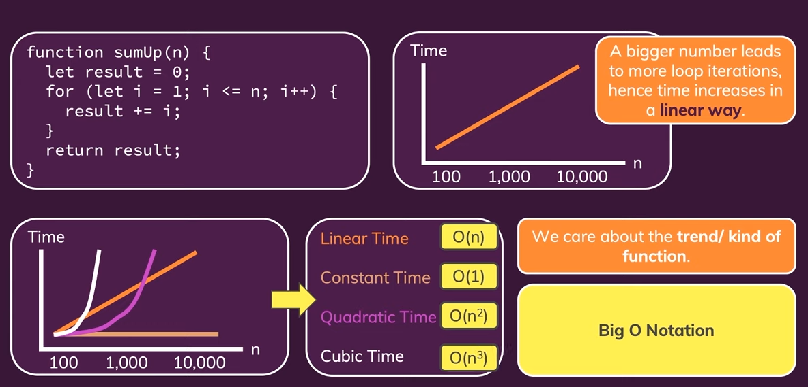

# Big-O notation

Mô tả cận trên hoặc trường hợp xấu nhất độ phức tạp của một thuật toán tỉ lệ như thế nào khi tăng số lượng phần tử 

O(2N) = O(N) = O(669N)

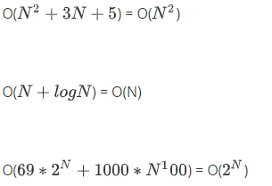


```javascript
for (int a : arrA) {
    print(a );
 }
for (int b : arrB) {
   print(b) ;
}
//O(N)
for (int a : arrA) {
    for (int b : arrB) {
    print( a + " , " + b);
   }
}
//O(N^2)
```

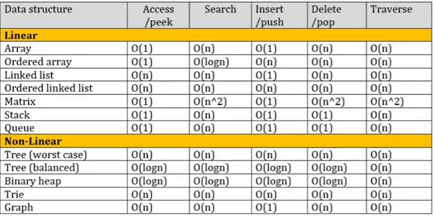

https://algs4.cs.princeton.edu/cheatsheet/

# Recursion


JSON parse/ JSON stringify

DOM traversal

Object traversal

alternative to iteration

## JS


# Dynamic program

cached, solve small problem and memo the result for next time

sub problem **overlap**


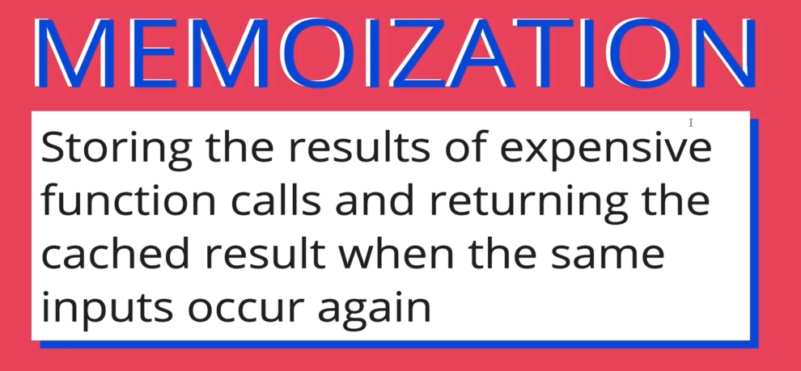

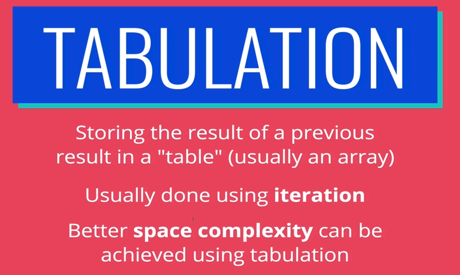

# Data structure

https://medium.com/omarelgabrys-blog/data-structures-language-support-5f70f8312e84

https://en.wikipedia.org/wiki/List_of_data_structures

https://github.com/ashish-chopra/Structures


JS

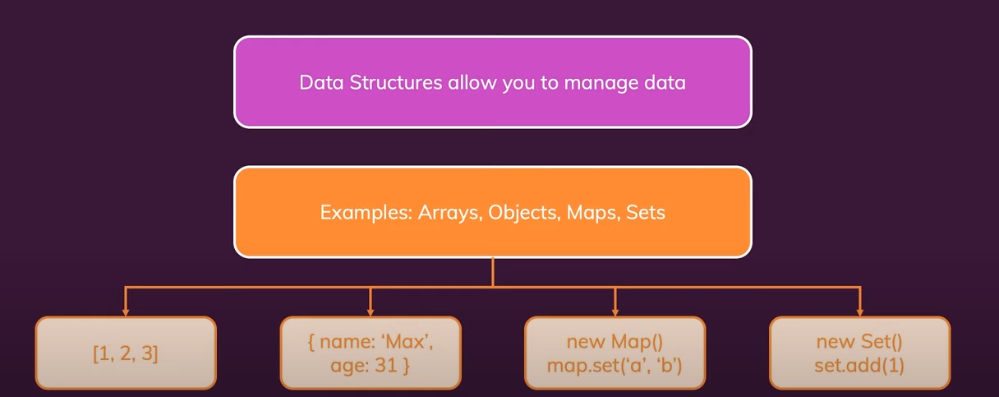

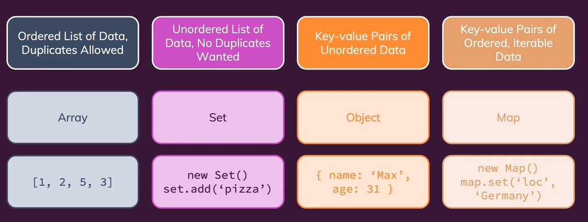

## Array

+Fast access: O(1)

+Fast push/pop (end of array): O(1)

+Ordered (close in memory)

-Slow insert/delete (shift elements to keep ordered): O(n)

-Add new when dynamic array full O(n)

Search: O(n)

```js
class MyArray {
  constructor() {
    this.length = 0;
    this.data = {};
  }
  get(index) {
    return this.data[index];
  }
  push(item) {
    this.data[this.length] = item;
    this.length++;
    return this.data;
  }
  pop() {
    const lastItem = this.data[this.length - 1];
    delete this.data[this.length - 1];
    this.length--;
    return lastItem;
  }
  deleteAtIndex(index) {
    const item = this.data[index];
    this.shiftItems(index);
    return item;
  }
  shiftItems(index) {
    for (let i = index; i < this.length - 1; i++) {
      this.data[i] = this.data[i + 1];
    }
    console.log(this.data[this.length - 1]);
    delete this.data[this.length - 1];
    this.length--;
  }
}
```

## Hash table

https://www.cs.usfca.edu/~galles/visualization/OpenHash.html

https://en.wikipedia.org/wiki/Comparison_of_programming_languages_(associative_array)

(hash map, map, ordered map, dict(ionary))

key (transformed (hash) to index (in memory) by **hash function**) - value pair

+insert O(1)

+access O(1) //O(n) if many collisions

+delete O(1)

+search O(1)

### hash function

transform input to a random pattern

+ one way => from result cannot find out the input
+ same input => same result (idempotent)

=> time comusing

### hash collisions

-chain keys's value have same index (linked list)

-move to next free space

```js
class HashTable {
  constructor(size){
    this.data = new Array(size);
    // this.data = [];
  }

  _hash(key) {
    let hash = 0;
    for (let i =0; i < key.length; i++){
        hash = (hash + key.charCodeAt(i) * i) % this.data.length
    }
    return hash;
  }

  set(key, value) {
    let address = this._hash(key);
    if (!this.data[address]) {
      this.data[address] = [];
    }
    this.data[address].push([key, value]);
    return this.data;
  }

  get(key){
    const address = this._hash(key);
    const currentBucket = this.data[address]
    if (currentBucket) {
      for(let i = 0; i < currentBucket.length; i++){
        if(currentBucket[i][0] === key) {
          return currentBucket[i][1]
        }
      }
    }
    return undefined;
  }
  
  keys(){
    const keysArray = [];
    console.log(this.data.length);
    for (let i = 0; i < this.data.length; i++){
      if(this.data[i]){
        keysArray.push(this.data[i][0][0])
      }
    }
    return keysArray;
  }
}
```

## Hash table vs Array

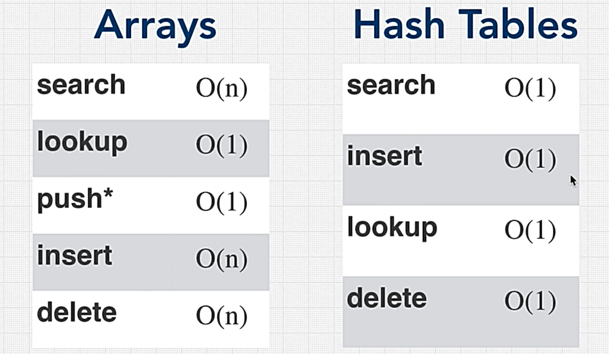

## Linked List

https://visualgo.net/en/list

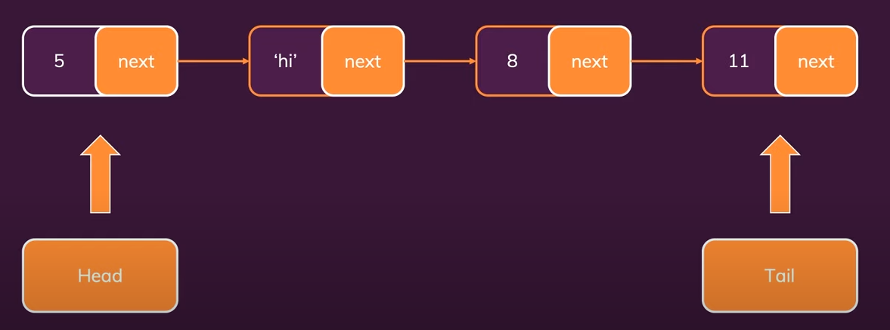

every element know next element => effient re-sizing

no need to specify memory size (flexible size)

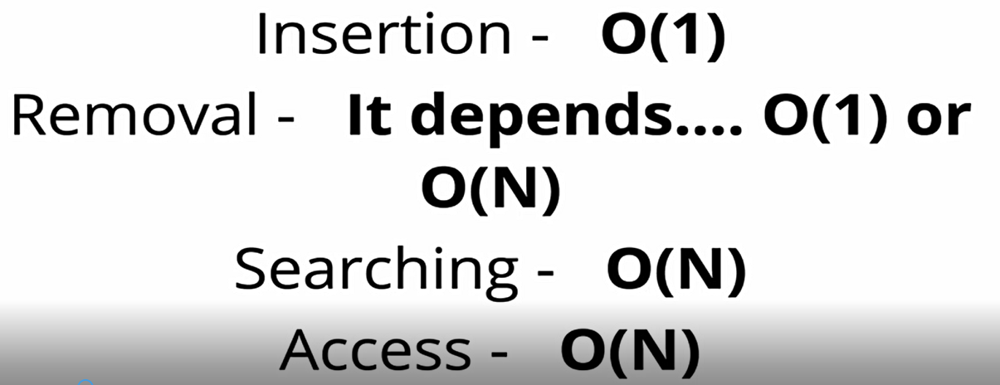

ordered

```js
class Node {
    constructor(value,next = null) {
        this.value = value
        this.next = null
    }
}
class LinkedList {
    constructor() {
        this.head = null
        this.tail = null
    }
    append(value) {
        const newNode = new Node(value)
        if (this.tail) {
            this.tail.next = newNode
        }
        this.tail = newNode
        if (!this.head) {
            this.head = newNode
        }
    }
    prepend(value) {
        const newNode = new Node(value,this.head)
        this.head = newNode
        if (!this.tail) {
            this.tail = newNode
        } 
    }
    delete(value) {
        if(!this.head) {
            return;
        }
        while(this.head && this.head.value === value) {
            this.head = this.head.next
        }
        let node = this.head
        while(node.next) {
            if(node.next.value === value) {
                node.next = node.next.next
            } else {
                node = node.next
            }
        }
        if(this.tail.value === value) {
            this.tail = node
        }
    }
    find(value) {
        if(!this.head) {
            return;
        }
        let node = this.head
        while(node.next) {
            if(node.next.value === value) {
                return node
            } else {
                node = node.next
            }
        }  
        return null
    }
    insertAfter(value,afterValue) {
        const node = this.find(afterValue)
        if(node) {
            const newNode = new Node(value, node.next)
            node.next = newNode
            if(node === this.tail) {
                this.tail = newNode 
            }
        }
    }
    toArray() {
        const array = []
        let node = this.head
        while(node) {
            array.push(node)
            node = node.next
        }
        return array
    }
}
```

## Linked list VS array

https://www.youtube.com/watch?v=DyG9S9nAlUM


## Queue

FIFO (first in firtst out)

ordered operation, callback queue, ...

linked list

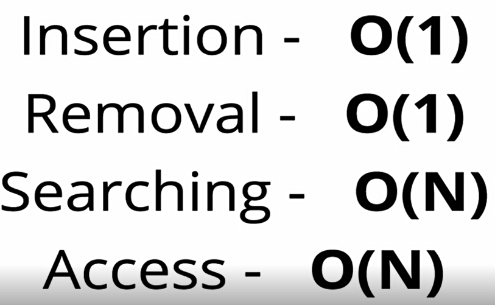

array => removal O(n) (normal array) O(1) (CircularQueue)

## Stack

LIFO (last in first out)

function call stack, browser history, undo, ...

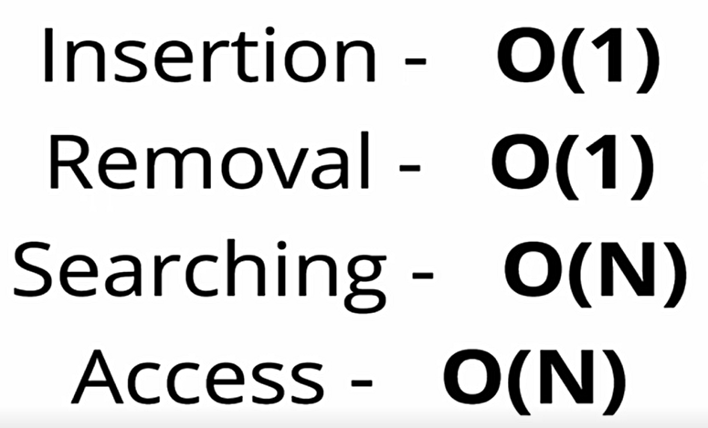

## Tree

one way


DOM, abstract syntax tree, ...

## Binary Tree


perfect tree: all leafs are full

full tree: all node not have 1 child (0 or 2)

## BST tree

https://visualgo.net/bn/bst?slide=1

is a **Binary Tree**

search O(logN)

insert O(logN)

delete O(logN)

=> can become a linked list if unbalance (worst case) O(n), no O(1) operation

```js
class Node {
  constructor(value){
    this.left = null;
    this.right = null;
    this.value = value;
  }
}

class BinarySearchTree {
  constructor(){
    this.root = null;
  }
  insert(value){
    const newNode = new Node(value);
    if (this.root === null) {
      this.root = newNode;
    } else {
      let currentNode = this.root;
      while(true){
        if(value < currentNode.value){
          //Left
          if(!currentNode.left){
            currentNode.left = newNode;
            return this;
          }
          currentNode = currentNode.left;
        } else {
          //Right
          if(!currentNode.right){
            currentNode.right = newNode;
            return this;
          } 
          currentNode = currentNode.right;
        }
      }
    }
  }
  lookup(value){
    if (!this.root) {
      return false;
    }
    let currentNode = this.root;
    while(currentNode){
      if(value < currentNode.value){
        currentNode = currentNode.left;
      } else if(value > currentNode.value){
        currentNode = currentNode.right;
      } else if (currentNode.value === value) {
        return currentNode;
      }
    }
    return null
  }
  remove(value) {
    if (!this.root) {
      return false;
    }
    let currentNode = this.root;
    let parentNode = null;
    while(currentNode){
      if(value < currentNode.value){
        parentNode = currentNode;
        currentNode = currentNode.left;
      } else if(value > currentNode.value){
        parentNode = currentNode;
        currentNode = currentNode.right;
      } else if (currentNode.value === value) {
        //We have a match, get to work!
        
        //Option 1: No right child: 
        if (currentNode.right === null) {
          if (parentNode === null) {
            this.root = currentNode.left;
          } else {
            
            //if parent > current value, make current left child a child of parent
            if(currentNode.value < parentNode.value) {
              parentNode.left = currentNode.left;
            
            //if parent < current value, make left child a right child of parent
            } else if(currentNode.value > parentNode.value) {
              parentNode.right = currentNode.left;
            }
          }
        
        //Option 2: Right child which doesnt have a left child
        } else if (currentNode.right.left === null) {
          currentNode.right.left = currentNode.left;
          if(parentNode === null) {
            this.root = currentNode.right;
          } else {
            
            //if parent > current, make right child of the left the parent
            if(currentNode.value < parentNode.value) {
              parentNode.left = currentNode.right;
            
            //if parent < current, make right child a right child of the parent
            } else if (currentNode.value > parentNode.value) {
              parentNode.right = currentNode.right;
            }
          }
        
        //Option 3: Right child that has a left child
        } else {

          //find the Right child's left most child
          let leftmost = currentNode.right.left;
          let leftmostParent = currentNode.right;
          while(leftmost.left !== null) {
            leftmostParent = leftmost;
            leftmost = leftmost.left;
          }
          
          //Parent's left subtree is now leftmost's right subtree
          leftmostParent.left = leftmost.right;
          leftmost.left = currentNode.left;
          leftmost.right = currentNode.right;

          if(parentNode === null) {
            this.root = leftmost;
          } else {
            if(currentNode.value < parentNode.value) {
              parentNode.left = leftmost;
            } else if(currentNode.value > parentNode.value) {
              parentNode.right = leftmost;
            }
          }
        }
      return true;
      }
    }
  }
  static traverse(node) {
  	const tree = { value: node.value };
  	tree.left = node.left === null ? null : traverse(node.left);
  	tree.right = node.right === null ? null : traverse(node.right);
  	return tree;
  }
}

const tree = new BinarySearchTree();
tree.insert(9)
tree.insert(4)
tree.insert(6)
tree.insert(20)
tree.insert(170)
tree.insert(15)
tree.insert(1)
tree.remove(170)
JSON.stringify(traverse(tree.root))

//     9
//  4     20
//1  6  15  170
```

### Balance Binary Tree

https://stackoverflow.com/questions/13852870/red-black-tree-over-avl-tree

AVL Tree

https://www.cs.usfca.edu/~galles/visualization/AVLtree.html

https://medium.com/basecs/the-little-avl-tree-that-could-86a3cae410c7

Red Black Tree

https://www.cs.usfca.edu/~galles/visualization/RedBlack.html

https://medium.com/basecs/painting-nodes-black-with-red-black-trees-60eacb2be9a5

## Heaps

https://visualgo.net/en/heap?slide=1

https://stackoverflow.com/questions/1699057/why-are-two-different-concepts-both-called-heap

max Heaps

min Heaps

the parents will be 'better' than the chidlren

## Binary Heaps


### Priority Queues

https://www.geeksforgeeks.org/implementation-priority-queue-javascript/

is a **Binary Heaps**

Highest priority go first

```js
// User defined class 
// to store element and its priority 
class QElement { 
    constructor(element, priority) 
    { 
        this.element = element; 
        this.priority = priority; 
    } 
} 
  
// PriorityQueue class 
class PriorityQueue { 
  
    // An array is used to implement priority 
    constructor() 
    { 
        this.items = []; 
    } 
    // enqueue function to add element to the queue as per priority 
    enqueue(element, priority) 
    { 
        // creating object from queue element 
        var qElement = new QElement(element, priority); 
        var contain = false; 

        // iterating through the entire 
        // item array to add element at the 
        // correct location of the Queue 
        for (var i = 0; i < this.items.length; i++) { 
            if (this.items[i].priority > qElement.priority) { 
                // Once the correct location is found it is 
                // enqueued 
                this.items.splice(i, 0, qElement); 
                contain = true; 
                break; 
            } 
        } 

        // if the element have the highest priority 
        // it is added at the end of the queue 
        if (!contain) { 
            this.items.push(qElement); 
        } 
    } 

    // dequeue method to remove element from the queue 
    dequeue() 
    { 
        // return the dequeued element 
        // and remove it. 
        // if the queue is empty 
        // returns Underflow 
        if (this.isEmpty()) 
            return "Underflow"; 
        return this.items.shift(); 
    } 
    // front function 
    front() 
    { 
        // returns the highest priority element 
        // in the Priority queue without removing it. 
        if (this.isEmpty()) 
            return "No elements in Queue"; 
        return this.items[0]; 
    }
    // rear function 
    rear() 
    { 
        // returns the lowest priorty 
        // element of the queue 
        if (this.isEmpty()) 
            return "No elements in Queue"; 
        return this.items[this.items.length - 1]; 
    } 
    // isEmpty function 
    isEmpty() 
    { 
        // return true if the queue is empty. 
        return this.items.length == 0; 
    } 
    // printQueue function prints all the element of the queue 
    printPQueue() 
    { 
        var str = ""; 
        for (var i = 0; i < this.items.length; i++) 
            str += this.items[i].element + " "; 
        return str; 
    } 
} 
```


## Tries

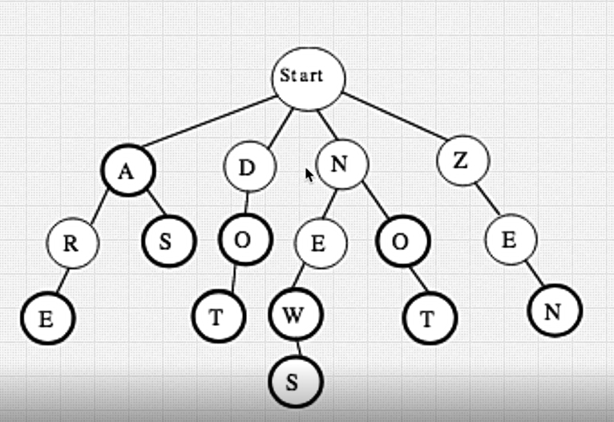

string problem

## Graphs

https://visualgo.net/en/graphds?slide=1

Relations

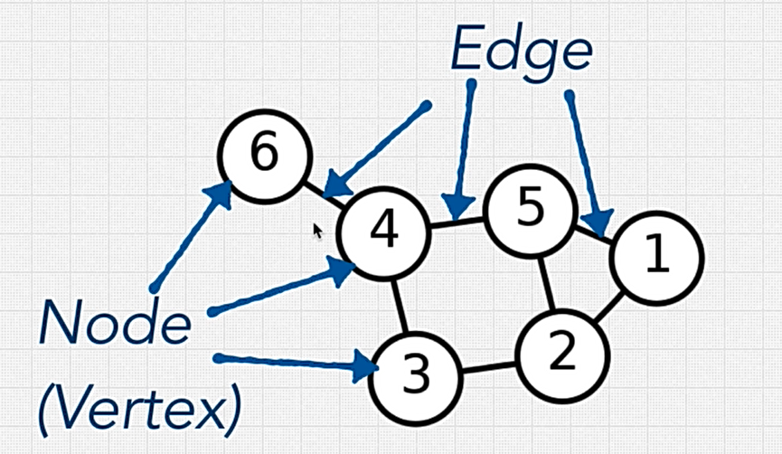

social network, map, ...

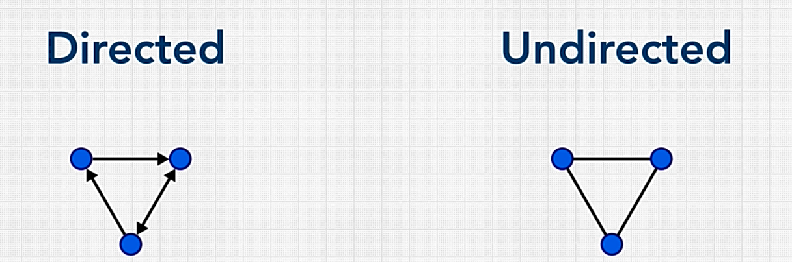

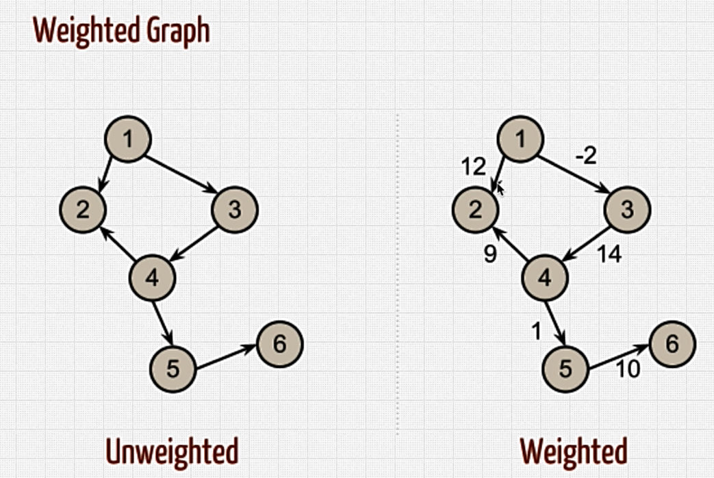

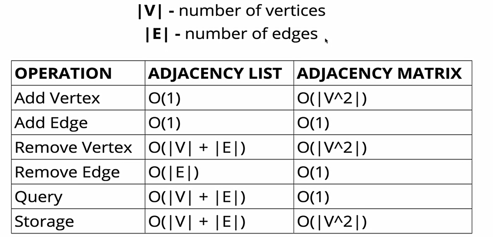

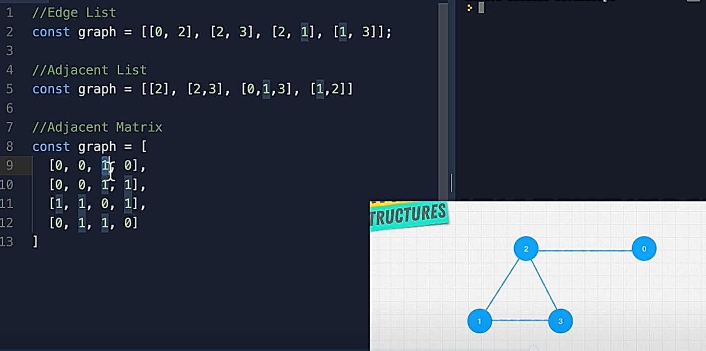

```js
class Graph { 
  constructor() { 
    this.numberOfNodes = 0; 
    this.adjacentList = {}; 
  } 
  addVertex(node)  { 
    this.adjacentList[node] = []; 
    this.numberOfNodes++;
  } 
  addEdge(node1, node2) { 
    //uniderected Graph 
    this.adjacentList[node1].push(node2); 
    this.adjacentList[node2].push(node1); 
  } 
  showConnections() { 
    const allNodes = Object.keys(this.adjacentList); 
    for (let node of allNodes) { 
      let nodeConnections = this.adjacentList[node]; 
      let connections = ""; 
      let vertex;
      for (vertex of nodeConnections) {
        connections += vertex + " ";
      } 
      console.log(node + "-->" + connections); 
    } 
  } 
} 
```

# Algorithms

https://gist.github.com/TSiege/cbb0507082bb18ff7e4b

https://www.interviewcake.com/sorting-algorithm-cheat-sheet

https://sinon.org/algorithms/

https://github.com/phishman3579/java-algorithms-implementation

https://visualgo.net/en

https://xlinux.nist.gov/dads/

https://algs4.cs.princeton.edu/home/

https://www.bigocheatsheet.com/

https://www.clear.rice.edu/comp160/data_cheat.html

http://www.sergiy.ca/guide-to-selecting-appropriate-map-collection-in-java/

http://cooervo.github.io/Algorithms-DataStructures-BigONotation/index.html


## Partterns


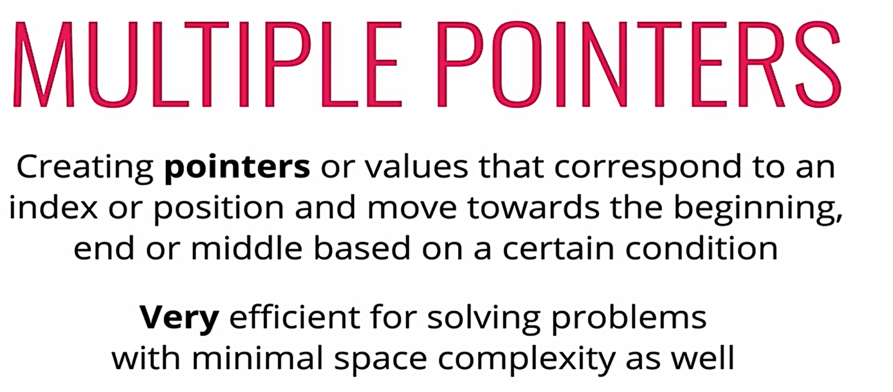

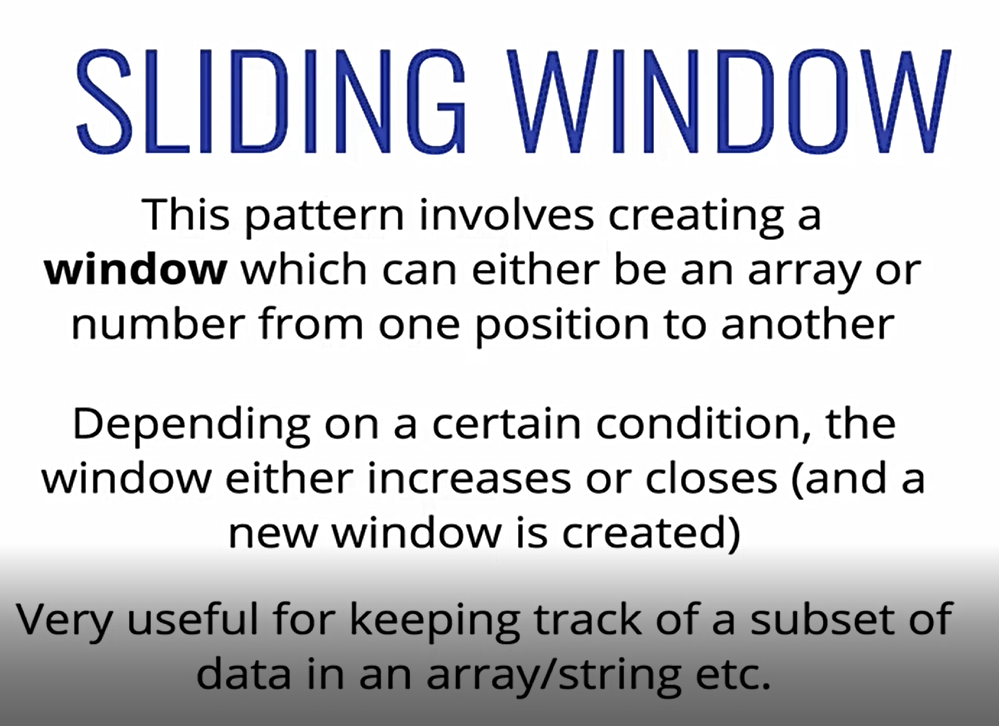

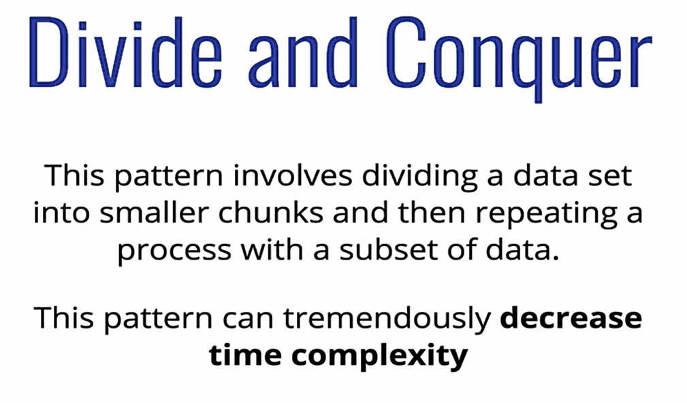

# Search

linear search

O(1) O(n)

binary search

O(1) O(logN)

# Sort

https://www.toptal.com/developers/sorting-algorithms

## Bubble Sort

```
Bubble Sort is the simplest sorting algorithm that works by repeatedly swapping the adjacent elements if they are in wrong order.

**Example:**
**First Pass:**
( **5** **1** 4 2 8 ) –> ( **1** **5** 4 2 8 ), Here, algorithm compares the first two elements, and swaps since 5 > 1.
( 1 **5** **4** 2 8 ) –> ( 1 **4** **5** 2 8 ), Swap since 5 > 4
( 1 4 **5** **2** 8 ) –> ( 1 4 **2** **5** 8 ), Swap since 5 > 2
( 1 4 2 **5** **8** ) –> ( 1 4 2 **5** **8** ), Now, since these elements are already in order (8 > 5), algorithm does not swap them.

**Second Pass:**
( **1** **4** 2 5 8 ) –> ( **1** **4** 2 5 8 )
( 1 **4** **2** 5 8 ) –> ( 1 **2** **4** 5 8 ), Swap since 4 > 2
( 1 2 **4** **5** 8 ) –> ( 1 2 **4** **5** 8 )
( 1 2 4 **5** **8** ) –> ( 1 2 4 **5** **8** )
Now, the array is already sorted, but our algorithm does not know if it is completed. The algorithm needs one **whole** pass without **any** swap to know it is sorted.

**Third Pass:**
( **1** **2** 4 5 8 ) –> ( **1** **2** 4 5 8 )
( 1 **2** **4** 5 8 ) –> ( 1 **2** **4** 5 8 )
( 1 2 **4** **5** 8 ) –> ( 1 2 **4** **5** 8 )
( 1 2 4 **5** **8** ) –> ( 1 2 4 **5** **8** )
```

## Selection Sort

```
arr[] = 64 25 12 22 11

// Find the minimum element in arr[0...4]
// and place it at beginning
11 25 12 22 64

// Find the minimum element in arr[1...4]
// and place it at beginning of arr[1...4]
11 12 25 22 64

// Find the minimum element in arr[2...4]
// and place it at beginning of arr[2...4]
11 12 22 25 64

// Find the minimum element in arr[3...4]
// and place it at beginning of arr[3...4]
11 12 22 25 64 
```

## Insertion sort


## B vs S vs I sort

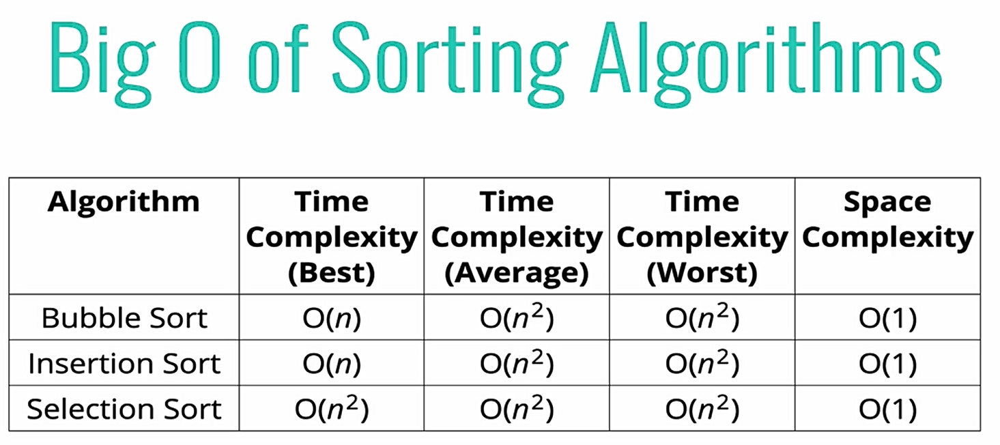

## Merge sort

https://www.geeksforgeeks.org/merge-sort/


```
MergeSort(arr[], l,  r)
If r > l
     1. Find the middle point to divide the array into two halves:  
             middle m = (l+r)/2
     2. Call mergeSort for first half:   
             Call mergeSort(arr, l, m)
     3. Call mergeSort for second half:
             Call mergeSort(arr, m+1, r)
     4. Merge the two halves sorted in step 2 and 3:
             Call merge(arr, l, m, r)
```

Sort linklist, Count inversion, external sorting

Time: O(N\*logN)

Space: O(n)

## Quicksort

https://www.geeksforgeeks.org/quick-sort/

```
/* low  --> Starting index,  high  --> Ending index */
quickSort(arr[], low, high)
{
    if (low < high)
    {
        /* pi is partitioning index, arr[pi] is now
           at right place */
        pi = partition(arr, low, high);

        quickSort(arr, low, pi - 1);  // Before pi
        quickSort(arr, pi + 1, high); // After pi
    }
}
```


## Radix sort

**1)** Do following for each digit i where i varies from least significant digit to the most significant digit.
………….**a)** Sort input array using counting sort (or any stable sort) according to the i’th digit.

```
170, 45, 75, 90, 802, 24, 2, 66
Sorting by least significant digit (1s place) gives: [*Notice that we keep 802 before 2, because 802 occurred before 2 in the original list, and similarly for pairs 170 & 90 and 45 & 75.]

Sorting by next digit (10s place) gives: [*Notice that 802 again comes before 2 as 802 comes before 2 in the previous list.]

802, 2, 24, 45, 66, 170, 75, 90
Sorting by most significant digit (100s place) gives:

2, 24, 45, 66, 75, 90, 170, 802
```

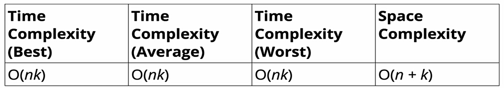

## JS sort

-if no comparator => sort by alphabet (unicode)

-With comparator:

returns negative => a before b

return positive => a after b

return 0 => same

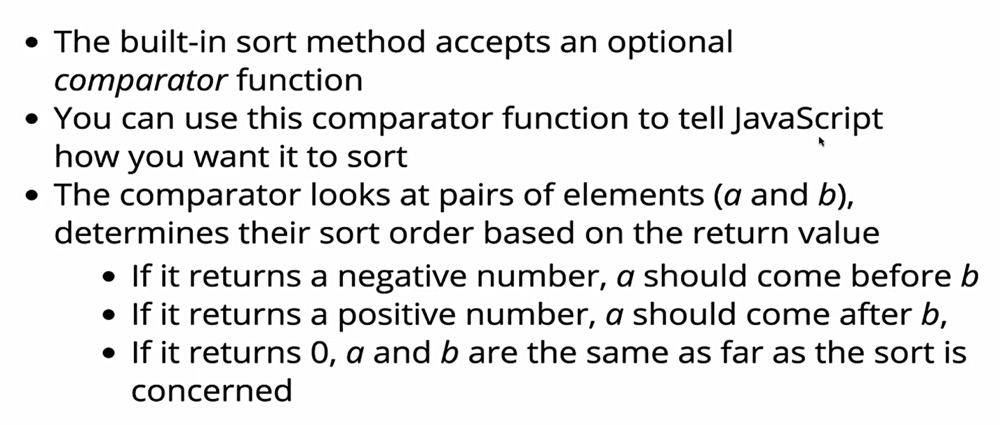

# More

https://vnoi.info/wiki/Home

https://www.reddit.com/r/learnprogramming/comments/3gpvyx/algorithms_and_data_structures_cheat_sheets/?sort=confidence

https://thimbleby.gitlab.io/algorithm-wiki-site/

https://visualgo.net/en

https://cse.buffalo.edu/~hungngo/classes/2014/Fall/250/notes.html

https://www3.cs.stonybrook.edu/~algorith/video-lectures/

https://algs4.cs.princeton.edu/home/

http://blog.notdot.net/tag/damn-cool-algorithms

More on Algorithms & Data Structures: https://adrianmejia.com/how-you-can-change-the-world-learning-data-structures-algorithms-free-online-course-tutorial/

Understanding Time Complexity & Big O (incl. Examples): https://adrianmejia.com/most-popular-algorithms-time-complexity-every-programmer-should-know-free-online-tutorial-course/

https://pro.academind.com/p/javascript-datastructures-the-fundamentals

More on Data Structures: https://adrianmejia.com/data-structures-time-complexity-for-beginners-arrays-hashmaps-linked-lists-stacks-queues-tutorial/

A Comprehensive Collection of Examples: https://github.com/trekhleb/javascript-algorithms

Introduction:

https://www.geeksforgeeks.org/data-structures/https://www.tutorialspoint.com/data_structures_algorithms/data_structures_basics.htm

Measuring Efficiency with BigO Notation

https://www.bigocheatsheet.com/https://medium.com/@binyamin/data-structures-and-big-o-notation-ec7ac060f186

https://www.101computing.net/big-o-notation/

https://hackernoon.com/what-does-the-time-complexity-o-log-n-actually-mean-45f94bb5bfbf

The Array:

https://www.geeksforgeeks.org/introduction-to-arrays/

https://www.w3schools.com/python/python_arrays.asp

https://docs.oracle.com/javase/tutorial/java/nutsandbolts/arrays.html

https://www.bigocheatsheet.com/

https://processing.org/tutorials/2darray/

https://www.faceprep.in/data-structures/advantages-and-disadvantages-of-arrays/
The ArrayList:

https://www.w3schools.com/java/java_arraylist.asp

https://www.w3schools.com/python/python_ref_list.asp

https://courses.cs.washington.edu/courses/cse341/98au/java/jdk1.2beta4/docs/api/java/util/ArrayList.html

https://www.programiz.com/python-programming/methods/list

https://www.tutorialspoint.com/java/java_arraylist_class.htm

https://www.w3resource.com/java-tutorial/arraylist/arraylist_object-toarray.php

https://stackoverflow.com/questions/23245386/how-does-memory-allocation-of-an-arraylist-work/23245487

https://www.geeksforgeeks.org/array-vs-arraylist-in-java/

The Stack:

https://www.callicoder.com/java-stack/

https://www.geeksforgeeks.org/stack-in-python/

https://docs.microsoft.com/en-us/dotnet/api/system.collections.stack?view=netcore-3.1

https://www.geeksforgeeks.org/stack-push-and-pop-in-c-stl/

https://www.tutorialsteacher.com/csharp/csharp-stack#contains

https://www.bigocheatsheet.com/https://www.quora.com/What-are-the-real-life-applications-of-stack-data-structure

The Queue:

https://www.geeksforgeeks.org/how-to-create-a-queue-in-c-sharp

https://www.javatpoint.com/java-priorityqueue

https://docs.oracle.com/javase/7/docs/api/java/util/Queue.html

https://www.geeksforgeeks.org/queue-interface-java/

https://www.quora.com/What-are-some-real-world-applications-of-a-queue-data-structure-1

https://www.studytonight.com/data-structures/queue-data-structure

The LinkedList:

https://stackoverflow.com/questions/644167/what-is-a-practical-real-world-example-of-the-linked-list

https://medium.com/future-vision/data-structures-algorithms-linked-lists-fc0b8a82d609 

https://www.geeksforgeeks.org/linked-list-set-3-deleting-node/

[https://www.interviewbit.com/courses/programming/topics/linked-lists](https://www.interviewbit.com/courses/programming/topics/linked-lists/#:~:text=A linked list is a,has a reference to null.)

https://docs.oracle.com/javase/7/docs/api/java/util/LinkedList.html

[https://techdifferences.com/difference-between-linear-and-non-linear-data-structure.html](https://techdifferences.com/difference-between-linear-and-non-linear-data-structure.html#:~:text=In the linear data structure%2C the data is organized in,linked one after the other.&text=Examples of the linear data,the non-linear data structure.)

https://realpython.com/linked-lists-python/https://www.tutorialspoint.com/python_data_structure/python_linked_lists.htm

https://www.geeksforgeeks.org/linked-list-set-1-introduction/

https://www.geeksforgeeks.org/data-structures/linked-list/

The Doubly-LinkedList:

[https://codeforwin.org/2015/10/doubly-linked-list-data-structure-in-c.html](https://codeforwin.org/2015/10/doubly-linked-list-data-structure-in-c.html#:~:text=Doubly linked list can be,implement Undo and Redo functionality.)

https://www.geeksforgeeks.org/doubly-linked-list/

Dictionaries + Hash Tables:

https://computersciencewiki.org/index.php/Dictionaries

[https://en.wikibooks.org/wiki/A-level_Computing/AQA/Paper_1/Fundamentals_of_data_structures/Dictionaries](https://en.wikibooks.org/wiki/A-level_Computing/AQA/Paper_1/Fundamentals_of_data_structures/Dictionaries#:~:text=A dictionary is a general,has a single associated value.&text=Different languages enforce different type,often implemented as hash tables.)

https://realpython.com/python-dicts/

https://www.geeksforgeeks.org/python-dictionary/

[https://brilliant.org/wiki/associative-arrays/#:~:text=Associative%20arrays%2C%20also%20called%20maps,a%20list%20of%20phone%20numbers.](https://brilliant.org/wiki/associative-arrays/#:~:text=Associative arrays%2C also called maps,a list of phone numbers.)

https://towardsdatascience.com/hash-tables-explained-5dc457db50da 

[https://www.hackerearth.com/practice/data-structures/hash-tables/basics-of-hash-tables/tutorial/](https://www.hackerearth.com/practice/data-structures/hash-tables/basics-of-hash-tables/tutorial/#:~:text=A hash table is a,function%2C hashing can work well.)

https://en.wikipedia.org/wiki/Associative_arrayhttps://en.wikipedia.org/wiki/Hash_functionhttps://en.wikipedia.org/wiki/Hash_table

Trees:

https://practice.geeksforgeeks.org/problems/advantages-and-disadvantages-of-bsthttps://www.codesdope.com/blog/article/trees-in-computer-science/https://www.quora.com/What-are-the-types-of-trees-in-data-structureshttps://www.quora.com/Who-invented-data-structures-like-stack-queues-and-linked-listshttp://pages.cs.wisc.edu/~vernon/cs367/notes/8.TREES.htmlhttps://computersciencewiki.org/index.php/Treehttps://www.freecodecamp.org/news/all-you-need-to-know-about-tree-data-structures-bceacb85490c/https://medium.com/brandons-computer-science-notes/trees-the-data-structure-e3cb5aabfee9

Tries:

https://www.interviewcake.com/concept/java/trie 

https://medium.com/basecs/trying-to-understand-tries-3ec6bede0014 ‘

Heaps:

[https://brilliant.org/wiki/heaps/](https://brilliant.org/wiki/heaps/#:~:text=Heaps are used in many,or minimum element very quickly.)https://brilliant.org/wiki/priority-queues/

https://www.geeksforgeeks.org/heap-sort/

https://medium.com/@randerson112358/max-heap-deletion-step-by-step-f402861523da

https://medium.com/@randerson112358/lets-build-a-max-heap-161d676394e

Graphs:

https://medium.com/@BennettGarner/what-the-graph-a-beginners-simple-intro-to-graphs-in-computer-science-3808d542a0e5

http://web.cecs.pdx.edu/~sheard/course/Cs163/Doc/Graphs.html

https://www.geeksforgeeks.org/graph-data-structure-and-algorithms/

https://www.khanacademy.org/computing/computer-science/algorithms/graph-representation/a/describing-graphs

https://softwareengineering.stackexchange.com/questions/168058/what-are-graphs-in-laymens-terms

http://think-like-a-git.net/sections/graph-theory/directed-versus-undirected-graphs.html

https://www.baeldung.com/cs/graphs-directed-vs-undirected-graph

https://www.quora.com/Whats-the-difference-between-a-cyclic-and-an-acyclic-graph

https://en.wikipedia.org/wiki/Directed_acyclic_graph

http://courses.cs.vt.edu/~cs3114/Fall10/Notes/T22.WeightedGraphs.pdf