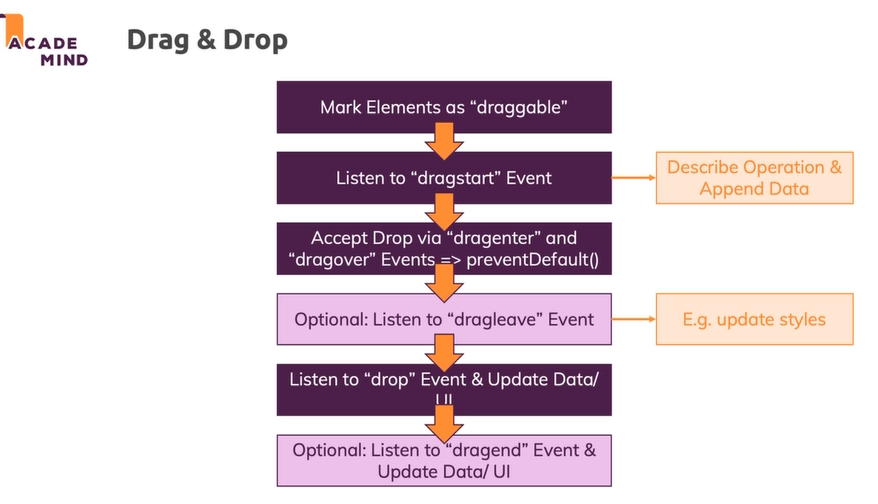
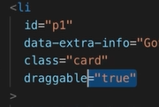
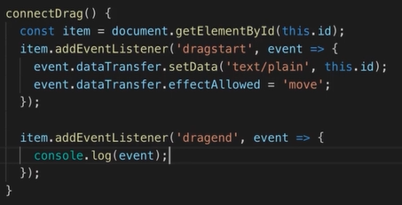
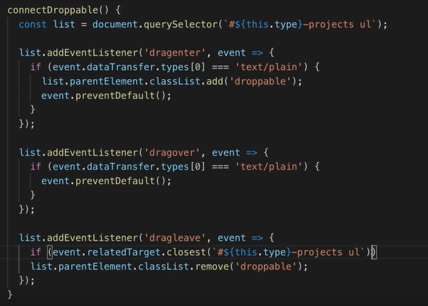
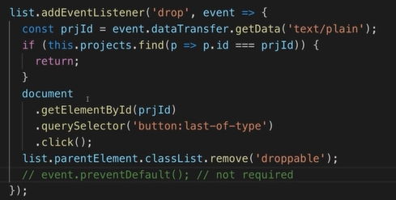
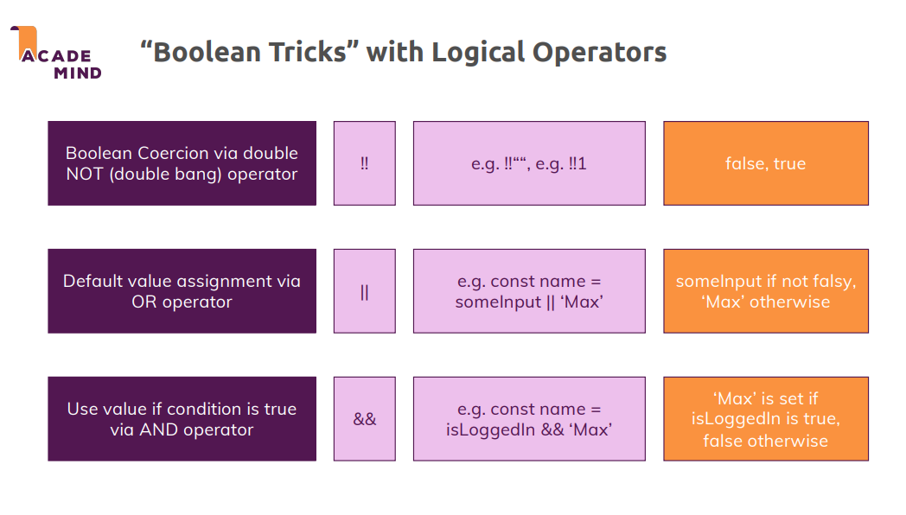
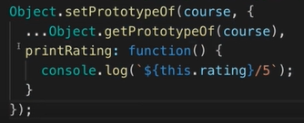

# debounce vs throttle

https://anonystick.com/blog-developer/debounce-vs-throttle-javascript-202005261421546

https://stackoverflow.com/questions/25991367/difference-between-throttling-and-debouncing-a-function

https://dev.to/iyashsoni/javascript-debounce-vs-throttle-392i

https://codeburst.io/throttling-and-debouncing-in-javascript-b01cad5c8edf

https://lodash.com/docs/4.17.15#debounce

https://lodash.com/docs/4.17.15#throttle

https://css-tricks.com/debouncing-throttling-explained-examples/

```js
    function debounce (fn, delay) {
        let timeOutId = null;
        return args => {
            clearTimeout(fn.id)
            timeOutId = setTimeout(() => {
                fn.call(this, args)
            }, delay)
        }
    }
    function throttle (fn, delay) {
        let timeOutId = null;
        return args => {
            if (timeOutId) return
            timeOutId = setTimeout(() => {
                fn.call(this, args)
                clearTimeout(timeOutId)
                timeOutId = null
            }, delay)
        }
    }
```


# **`forEach`**

- Iterates through the elements in an array.
- Executes a callback for each element.
- Does not return a value.

```javascript
const a = [1, 2, 3];
a.forEach((num, index) => {
  // Do something with num and/or index.
});
```

If you simply need to iterate over an array, `forEach` is a fine choice.

# **`map`**

- Iterates through the elements in an array.
- "Maps" each element to a new element by calling the function on each element, creating a new array as a result.

```javascript
const a = [1, 2, 3];
const doubled = a.map(num => {
  return num * 2;
});

// doubled = [2, 4, 6]
```

If you need the result, but do not wish to mutate the original array, `.map()` is the clear choice. 

# Drag & Drop

https://developer.mozilla.org/en-US/docs/Web/API/HTML_Drag_and_Drop_API

https://developer.mozilla.org/en-US/docs/Web/API/HTML_Drag_and_Drop_API/Recommended_drag_types

https://developer.mozilla.org/en-US/docs/Web/API/DataTransfer/effectAllowed











## Infinitive scrolling

```js
let curElementNumber = 0;

function scrollHandler() {
    const distanceToBottom = document.body.getBoundingClientRect().bottom;

    if (distanceToBottom < document.documentElement.clientHeight + 150) {
        const newDataElement = document.createElement('div');
        curElementNumber++;
        newDataElement.innerHTML = `<p>Element ${curElementNumber}</p>`;
        document.body.append(newDataElement);
    }
}

window.addEventListener('scroll', scrollHandler);
```

**So what's happening here?**

At the very bottom, we register the `scrollHandler` function as a handler for the `'scroll'` event on our window object.

Inside that function, we first of all **measure the total distance** between our viewport (top left corner of what we currently see) and the end of the page (**not** just the end of our currently visible area) => Stored in `distanceToBottom`.

*For example, if our browser window has a height of* `500px`*, then distanceToBottom could be* `684px`*, assuming that we got some content we can scroll to.*

Next, we **compare the distance** to the bottom of our overall content (`distanceToBottom`) **to the window height + a certain threshold** (in this example `150px`). `document.documentElement.clientHeight` is preferable to `window.innerHeight` because it respects potential scroll bars.

If we have **less than** **150px** **to the end of our page content**, we make it into the if-block (where we append new data).

Inside of the if-statement, we then create a new `<div>` element and populate it with a `<p>` element which in turn outputs an incrementing counter value.

## Difference between console.dir and console.log

The **console.log()** returns the object in its string representation and **console.dir()** recognizes the object just as an object and outputs its properties. Both log() and dir() returns the string just as a string.

## Boolean trick



## import external "\<script>" to html

Download both script and HTML

Run script after browser parsed and rendered all the HTML

- Put script to end of body: have to wait downloading and parsing HTML complete then begin downloading and executing script
- If async is present: The script is executed asynchronously with the rest of the page (the script will be executed while the page continues the parsing)
- If async is not present and defer is present: The script is executed when the page has finished parsing
- If neither async or defer is present: The script is fetched and executed immediately, before the browser continues parsing the page

## Obj equality

```javascript
function isEquivalent(a, b) {
    // Create arrays of property names
    var aProps = Object.getOwnPropertyNames(a);
    var bProps = Object.getOwnPropertyNames(b);

    // If number of properties is different,
    // objects are not equivalent
    if (aProps.length != bProps.length) {
        return false;
    }

    for (var i = 0; i < aProps.length; i++) {
        var propName = aProps[i];

        // If values of same property are not equal,
        // objects are not equivalent
        if (a[propName] !== b[propName]) {
            return false;
        }
    }

    // If we made it this far, objects
    // are considered equivalent
    return true;
}
```

## Remove duplicates of an array and return an array of only unique elements

```javascript
// ES6 Implementation
var array = [1, 2, 3, 5, 1, 5, 9, 1, 2, 8];
Array.from(new Set(array)); // [1, 2, 3, 5, 9, 8]
// ES5 Implementation
var array = [1, 2, 3, 5, 1, 5, 9, 1, 2, 8];
uniqueArray(array); // [1, 2, 3, 5, 9, 8]
function uniqueArray(array) {
  var hashmap = {};
  var unique = [];
  for(var i = 0; i < array.length; i++) {
    // If key returns undefined (unique), it is evaluated as false.
    if(!hashmap[array[i]]) {
      hashmap[array[i]] = 1;
      unique.push(array[i]);
    }
  }
  console.log(unique);
}
```

## Reverse string 

```javascript
var string = "Welcome to this Javascript Guide!";

// Output becomes !ediuG tpircsavaJ siht ot emocleW
var reverseEntireSentence = reverseBySeparator(string, "");

// Output becomes emocleW ot siht tpircsavaJ !ediuG
var reverseEachWord = reverseBySeparator(reverseEntireSentence, " ");

function reverseBySeparator(string, separator) {
  return string.split(separator).reverse().join(separator);
}
```

## Empty array

```javascript
var arrayList = ['a', 'b', 'c', 'd', 'e', 'f']; // Created array
var anotherArrayList = arrayList;  // Referenced arrayList by another variable
arrayList = []; // Empty the array
console.log(anotherArrayList); // Output ['a', 'b', 'c', 'd', 'e', 'f']

var arrayList = ['a', 'b', 'c', 'd', 'e', 'f']; // Created array
var anotherArrayList = arrayList;  // Referenced arrayList by another variable
arrayList.length = 0; // Empty the array by setting length to 0
console.log(anotherArrayList); // Output []

var arrayList = ['a', 'b', 'c', 'd', 'e', 'f']; // Created array
var anotherArrayList = arrayList;  // Referenced arrayList by another variable
arrayList.splice(0, arrayList.length); // Empty the array by setting length to 0
console.log(anotherArrayList); // Output []

while(arrayList.length) {
  arrayList.pop();
}
```

## Is Array

```javascript
Array.isArray(arrayList);
```

## Closure private variables

```js
function counter() {
  var _counter = 0;
  // return an object with several functions that allow you
  // to modify the private _counter variable
  return {
    add: function(increment) { _counter += increment; },
    retrieve: function() { return 'The counter is currently at: ' + _counter; }
  }
}

// error if we try to access the private variable like below
// _counter;

// usage of our counter function
var c = counter();
c.add(5); 
c.add(9); 

// now we can access the private variable in the following way
c.retrieve(); // => The counter is currently at: 14
```

## Set prototype



## Check integer

```js
function isInt(num) {
  return num % 1 === 0;
}
```

## Iterating

For objects:

- `for` loops - `for (var property in obj) { console.log(property); }`. However, this will also iterate through its inherited properties, and you will add an `obj.hasOwnProperty(property)` check before using it.
- `Object.keys()` - `Object.keys(obj).forEach(function (property) { ... })`. `Object.keys()` is a static method that will lists all enumerable properties of the object that you pass it.
- `Object.getOwnPropertyNames()` - `Object.getOwnPropertyNames(obj).forEach(function (property) { ... })`. `Object.getOwnPropertyNames()` is a static method that will lists all enumerable and non-enumerable properties of the object that you pass it.

For arrays:

- `for` loops - `for (var i = 0; i < arr.length; i++)`. The common pitfall here is that `var` is in the function scope and not the block scope and most of the time you would want block scoped iterator variable. ES2015 introduces `let` which has block scope and it is recommended to use that instead. So this becomes: `for (let i = 0; i < arr.length; i++)`.
- `forEach` - `arr.forEach(function (el, index) { ... })`. This construct can be more convenient at times because you do not have to use the `index` if all you need is the array elements. There are also the `every` and `some` methods which will allow you to terminate the iteration early.

## Difference between document `load` event and document `DOMContentLoaded` event?

The `load` event fires at the end of the document loading process. At this point, all of the objects in the document are in the DOM, and all the images, scripts, links and sub-frames have finished loading.

The DOM event `DOMContentLoaded` will fire after the DOM for the page has been constructed, but do not wait for other resources to finish loading. This is preferred in certain cases when you do not need the full page to be loaded before initializing.

## Error

```javascript
var err1 = Error('message');
var err2 = new Error('message');
```

## What's the difference between an "attribute" and a "property"?

Attributes are defined on the HTML markup but properties are defined on the DOM

```javascript
const input = document.querySelector("input");
console.log(input.getAttribute("value")); // Hello
console.log(input.value); // Hello
```

But after you change the value of the text field by adding "World!" to it, this becomes:

```javascript
console.log(input.getAttribute("value")); // Hello
console.log(input.value); // Hello World!
```

## Singleton

```js
class Singleton {
    constructor() {
        const instance = this.constructor.instance;
        if (instance) {
            return instance;
        }
        this.constructor.instance = this;
    }
    foo() {
        // ...
    }
}
```

## The Module Pattern

```javascript
var Module = (function() {
    function privateMethod() {
        // do something
    }

    return {
        publicMethod: function() {
            // can call privateMethod();
        }
    };
})();
Module.publicMethod(); // works
Module.privateMethod(); // Uncaught ReferenceError: privateMethod is not defined

var Module = (function () {
    function _privateMethod() {
        // do something
    }
    function publicMethod() {
        // do something
    }
    return {
        publicMethod: publicMethod,
    }
})();
```

## Private scope

In JavaScript, there is no such thing as public or private scope. However, we can emulate this feature using closures.

```javascript
(function () {
  // private scope
})();
```

## HTTP request promise

```js
function get(url) {
  // Return a new promise.
  return new Promise(function(resolve, reject) {
    // Do the usual XHR stuff
    var req = new XMLHttpRequest();
    req.open('GET', url);

    req.onload = function() {
      // This is called even on 404 etc
      // so check the status
      if (req.status == 200) {
        // Resolve the promise with the response text
        resolve(req.response);
      }
      else {
        // Otherwise reject with the status text
        // which will hopefully be a meaningful error
        reject(Error(req.statusText));
      }
    };

    // Handle network errors
    req.onerror = function() {
      reject(Error("Network Error"));
    };

    // Make the request
    req.send();
  });
}
//Call
get('story.json').then(function(response) {
  console.log("Success!", response);
}, function(error) {
  console.error("Failed!", error);
})
```

## Pure prototype inheritance


## IIFE module

```js
;(function(global, $) {
    
    // 'new' an object
    var Greetr = function(firstName, lastName, language) {
        return new Greetr.init(firstName, lastName, language);   
    }
    
    // hidden within the scope of the IIFE and never directly accessible
    var supportedLangs = ['en', 'es'];
    
    // informal greetings
    var greetings = {
        en: 'Hello',
        es: 'Hola'
    };
    
    // formal greetings
    var formalGreetings = {
        en: 'Greetings',
        es: 'Saludos'
    };
    
    // logger messages
    var logMessages = {
        en: 'Logged in',
        es: 'Inició sesión'
    };
    
    // prototype holds methods (to save memory space)
    Greetr.prototype = {
        
        // 'this' refers to the calling object at execution time
        fullName: function() {
            return this.firstName + ' ' + this.lastName;   
        },
        
        validate: function() {
            // check that is a valid language
            // references the externally inaccessible 'supportedLangs' within the closure
             if (supportedLangs.indexOf(this.language)  === -1) {
                throw "Invalid language";   
             }
        },
        
        // retrieve messages from object by referring to properties using [] syntax
        greeting: function() {
            return greetings[this.language] + ' ' + this.firstName + '!';
        },
        
        formalGreeting: function() {
            return formalGreetings[this.language] + ', ' + this.fullName();  
        },
        
        // chainable methods return their own containing object
        greet: function(formal) {
            var msg;
            
            // if undefined or null it will be coerced to 'false'
            if (formal) {
                msg = this.formalGreeting();  
            }
            else {
                msg = this.greeting();  
            }

            if (console) {
                console.log(msg);
            }

            // 'this' refers to the calling object at execution time
            // makes the method chainable
            return this;
        },
        
        log: function() {
            if (console) {
                console.log(logMessages[this.language] + ': ' + this.fullName()); 
            }
            
            // make chainable
            return this;
        },
                            
        setLang: function(lang) {
            
            // set the language
            this.language = lang;
        
            // validate
            this.validate();
            
            // make chainable
            return this;
        },
        
        HTMLGreeting: function(selector, formal) {
            if (!$) {
                throw 'jQuery not loaded';   
            }
            
            if (!selector) {
                throw 'Missing jQuery selector';   
            }
            
            // determine the message
            var msg;
            if (formal) {
                msg = this.formalGreeting();   
            }
            else {
                msg = this.greeting();   
            }
            
            // inject the message in the chosen place in the DOM
            $(selector).html(msg);
            
            // make chainable
            return this;
        }
        
    };
    
    // the actual object is created here, allowing us to 'new' an object without calling 'new'
    Greetr.init = function(firstName, lastName, language) {
        
        var self = this;
        self.firstName = firstName || '';
        self.lastName = lastName || '';
        self.language = language || 'en';
        
        self.validate();
        
    }
    
    // trick borrowed from jQuery so we don't have to use the 'new' keyword
    Greetr.init.prototype = Greetr.prototype;
    
    // attach our Greetr to the global object, and provide a shorthand '$G' for ease our poor fingers
    global.Greetr = global.G$ = Greetr;
    
}(window, jQuery));
```

```js
// gets a new object (the architecture allows us to not have to use the 'new' keyword here)
var g = G$('John', 'Doe');

// use our chainable methods
g.greet().setLang('es').greet(true).log();

// let's use our object on the click of the login button
$('#login').click(function() {
   
    // create a new 'Greetr' object (let's pretend we know the name from the login)
    var loginGrtr = G$('John', 'Doe');
    
     // hide the login on the screen
    $('#logindiv').hide();
    
     // fire off an HTML greeting, passing the '#greeting' as the selector and the chosen language, and log the welcome as well
    loginGrtr.setLang($('#lang').val()).HTMLGreeting('#greeting', true).log();
    
});
```

```js
// gets a new object (the architecture allows us to not have to use the 'new' keyword here)
var g = G$('John', 'Doe');

// use our chainable methods
g.greet().setLang('es').greet(true).log();

// let's use our object on the click of the login button
$('#login').click(function() {
   
    // create a new 'Greetr' object (let's pretend we know the name from the login)
    var loginGrtr = G$('John', 'Doe');
    
     // hide the login on the screen
    $('#logindiv').hide();
    
     // fire off an HTML greeting, passing the '#greeting' as the selector and the chosen language, and log the welcome as well
    loginGrtr.setLang($('#lang').val()).HTMLGreeting('#greeting', true).log();
    
});
```

