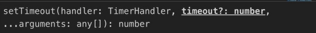
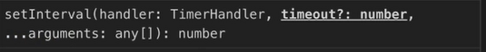
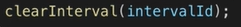
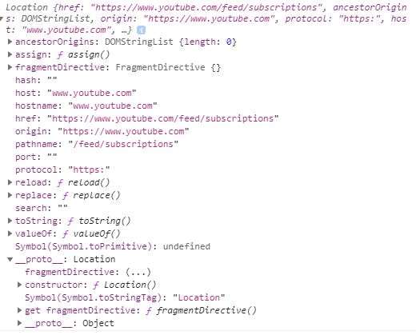
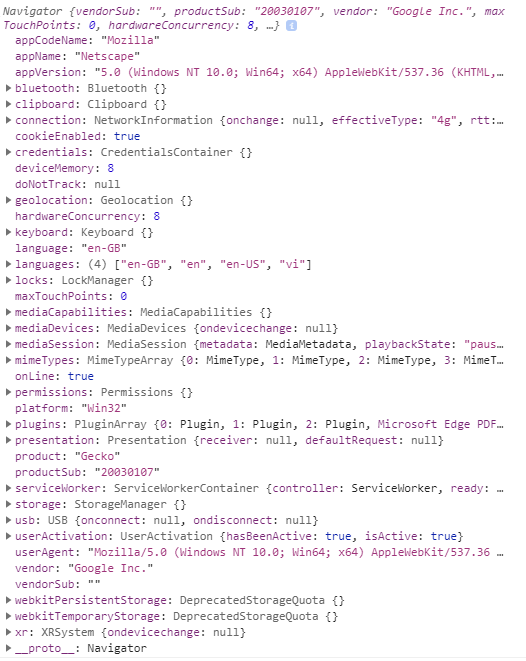
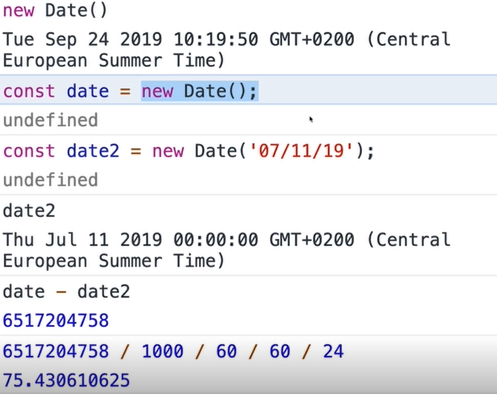

## Browser API

### DOM

Read more [JS_DOM.md](JS_DOM.md) 

### Timers & intervals








**minimum** time to run the callback (waiting for the callstack is empty)

### location (URL and page we're on)



### history


### navigator



### Date



### Error


### JSON 

Typically, data is transferred as "**JSON**" data between your client-side code and your backend ("the server").

JSON stands for **J**ava**S**cript **O**bject **N**otation and it looks like this:

```json
{
    "name": "Max",
    "age": 30,
    "hobbies": [
        { "id": "h1", "title": "Sports" },
        { "id": "h2", "title": "Cooking" }
    ],
    "isInstructor": true
}
```

JSON data supports **objects** (`{}`), **arrays** (`[]`), **strings** (MUST use double-quotes!), **numbers** (NO quotes) and **Booleans** (also NO quotes).

All object keys (e.g. "name") **HAVE to be wrapped by double quotes**.

Actually, the whole JSON "object" is wrapped in quotes itself because **JSON data in the end is just a string** that contains data in the format shown above.

```js
const person = { // this is NOT JSON - it's a normal ("raw") JavaScript object!
    name: 'Max',
    age: 30,
    hobbies: [
        { id: 'h1', title: 'Sports' },
        { id: 'h2', title: 'Cooking' }
    ],
    isInstructor: true
};

const jsonData = JSON.stringify(person); // convert raw JS data to JSON data string
console.log(jsonData); // a string with machine-readable JSON data in it
console.log(typeof jsonData); // string
```

We use JSON data because it's easy to parse for machines - and as an extra benefit it's also quite readable to us humans.

If you receive some JSON data and you want to convert it back into normal JS data, you can use `JSON.parse()`:

```js
const parsedData = JSON.parse(jsonData); // yields a "raw" JS object/ array etc.
```

You're **NOT LIMITED to objects** when converting data to JSON. You can also convert numbers, arrays, booleans or just strings - all data types JSON supports:

```js
const jsonNumber = JSON.stringify(2); // "2"
const jsonText = JSON.stringify('Hi there! I use single quotes in raw JS'); // ""Hi there! ...""
const jsonArray = JSON.stringify([1, 2, 3]); // "[1,2,3]"
const jsonBoolean = JSON.stringify(true); // "true"
```

### HTTP request

 [JS_HTTP.md](JS_HTTP.md) 

### Browser Storage

 [JS_Browser_Storage.md](JS_Browser_Storage.md) 