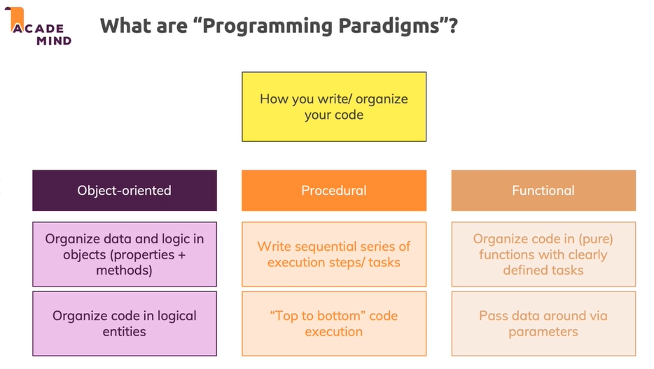

# Programming paradigm



# Procedural

Step by step

```js
const form = document.getElementById('user-input');

function signupHandler(event) {
  event.preventDefault();

  const userNameInput = document.getElementById('username');
  const enteredUsername = userNameInput.value;

  const passwordInput = document.getElementById('password');
  const enteredPassword = passwordInput.value;

  if (enteredUsername.trim().length === 0) {
    alert('Invalid input - username must not be empty!');
    return;
  }
  if (enteredPassword.trim().length <= 5) {
    alert('Invalid input - password must be six characters or longer.');
    return;
  }

  const user = {
    userName: enteredUsername,
    password: enteredPassword
  };

  console.log(user);
  console.log('Hi, I am ' + user.userName);
}

form.addEventListener('submit', signupHandler);

```

# Functional

Organize our code around function, reuse and sharing code by using function

```js
const REQUIRED = 'REQUIRED';
const MIN_LENGTH = 'MIN_LENGTH';

function validate(value, flag, validatorValue) {
  if (flag === REQUIRED) {
    return value.trim().length > 0;
  }
  if (flag === MIN_LENGTH) {
    return value.trim().length > validatorValue;
  }
}

function getUserInput(inputElementId) {
  return document.getElementById(inputElementId).value;
}

function createUser(userName, userPassword) {
  if (!validate(userName, REQUIRED) || !validate(userPassword, MIN_LENGTH, 5)) {
    throw new Error(
      'Invalid input - username or password is wrong (password should be at least six characters).'
    );
  }
  return {
    userName: userName,
    password: userPassword
  };
}

function greetUser(user) {
  console.log('Hi, I am ' + user.userName);
}

function signupHandler(event) {
  event.preventDefault();

  const enteredUsername = getUserInput('username');
  const enteredPassword = getUserInput('password');

  try {
    const newUser = createUser(enteredUsername, enteredPassword);
    console.log(newUser);
    greetUser(newUser);
  } catch (err) {
    alert(err.message);
  }
}

function connectForm(formId, formSubmitHandler) {
  const form = document.getElementById(formId);
  form.addEventListener('submit', formSubmitHandler);
}

connectForm('user-input', signupHandler);

```

# OOP

Think code as objects working together and we split our code logically into entities

```js
class Validator {
  static REQUIRED = 'REQUIRED';
  static MIN_LENGTH = 'MIN_LENGTH';

  static validate(value, flag, validatorValue) {
    if (flag === this.REQUIRED) {
      return value.trim().length > 0;
    }
    if (flag === this.MIN_LENGTH) {
      return value.trim().length > validatorValue;
    }
  }
}

class User {
  constructor(uName, uPassword) {
    this.userName = uName;
    this.password = uPassword;
  }

  greet() {
    console.log('Hi, I am ' + this.userName);
  }
}

class UserInputForm {
  constructor() {
    this.form = document.getElementById('user-input');
    this.userNameInput = document.getElementById('username');
    this.passwordInput = document.getElementById('password');

    this.form.addEventListener('submit', this.signupHandler.bind(this));
  }

  signupHandler(event) {
    event.preventDefault();
    const enteredUserName = this.userNameInput.value;
    const enteredPassword = this.passwordInput.value;

    if (
      !Validator.validate(enteredUserName, Validator.REQUIRED) ||
      !Validator.validate(enteredPassword, Validator.MIN_LENGTH, 5)
    ) {
      alert(
        'Invalid input - username or password is wrong (password should be at least six characters).'
      );
      return;
    }

    const newUser = new User(enteredUserName, enteredPassword);
    console.log(newUser);
    newUser.greet();
  }
}

new UserInputForm();
```


