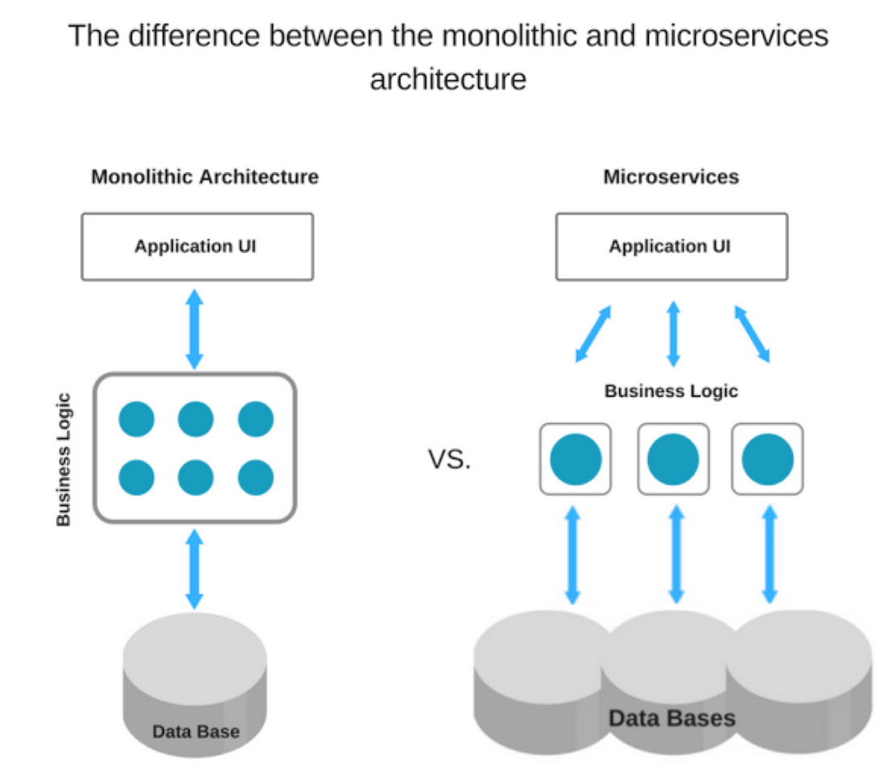
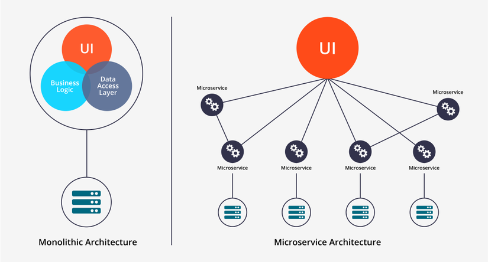

# [Architectural pattern](https://en.wikipedia.org/wiki/Architectural_pattern)

https://en.wikipedia.org/wiki/Software_architecture

https://towardsdatascience.com/10-common-software-architectural-patterns-in-a-nutshell-a0b47a1e9013

There are many recognized architectural patterns and styles, among them:

- [Blackboard](https://en.wikipedia.org/wiki/Blackboard_(computing))
- [Client-server](https://en.wikipedia.org/wiki/Client–server_model) (2-tier, [3-tier](https://en.wikipedia.org/wiki/Three-tier_(computing)), [*n*-tier](https://en.wikipedia.org/wiki/N-tier), [cloud computing](https://en.wikipedia.org/wiki/Cloud_computing) exhibit this style)
- [Component-based](https://en.wikipedia.org/wiki/Software_componentry)
- [Data-centric](https://en.wikipedia.org/wiki/Database-centric_architecture)
- [Event-driven](https://en.wikipedia.org/wiki/Event-driven_architecture) (or [implicit invocation](https://en.wikipedia.org/wiki/Implicit_invocation))
- [Layered](https://en.wikipedia.org/wiki/Abstraction_(computer_science)#Layered_architecture) (or [multilayered architecture](https://en.wikipedia.org/wiki/Multilayered_architecture))
- [Microservices architecture](https://en.wikipedia.org/wiki/Microservices)
- [Monolithic application](https://en.wikipedia.org/wiki/Monolithic_application)
- [Model-view-controller](https://en.wikipedia.org/wiki/Model–view–controller) (MVC)
- [Peer-to-peer](https://en.wikipedia.org/wiki/Peer-to-peer) (P2P)
- [Pipes and filters](https://en.wikipedia.org/wiki/Pipes_and_filters)
- [Plug-ins](https://en.wikipedia.org/wiki/Plug-in_(computing))
- [Reactive architecture](https://en.wikipedia.org/w/index.php?title=Reactive_architecture&action=edit&redlink=1)
- [Representational state transfer](https://en.wikipedia.org/wiki/Representational_state_transfer) (REST)
- [Rule-based](https://en.wikipedia.org/wiki/Rule-based_system)
- [Service-oriented](https://en.wikipedia.org/wiki/Service-oriented_architecture)
- [Shared nothing architecture](https://en.wikipedia.org/wiki/Shared_nothing_architecture)
- [Space-based architecture](https://en.wikipedia.org/wiki/Space-based_architecture)

# Monolithic

Monolith means composed all in one piece. The **Monolithic** application describes a single-tiered **software** application in which different components combined into a single program from a single platform. Components can be:

- Authorization — responsible for authorizing a user
- Presentation — responsible for handling HTTP requests and responding with either HTML or JSON/XML (for web services APIs).
- Business logic — the application’s business logic.
- Database layer — data access objects responsible for accessing the database.
- Application integration — integration with other services (e.g. via messaging or REST API). Or integration with any other Data sources.
- Notification module — responsible for sending email notifications whenever needed.

Chúng ta thường sử dụng kiến trúc một khối khi:

- Phạm vi ứng dụng là nhỏ và được xác định rõ. Bạn chắc chắn ứng dụng sẽ không phát triển mạnh về các tính năng. Ví dụ: blog, web mua sắm trực tuyến đơn giản, ứng dụng CRUD đơn giản…
- Team-size nhỏ, thường ít hơn 8 người.
- Mặt bằng kỹ năng của các thành viên trong team thường không cao.
- Thời gian để có thể marketing là quan trọng.
- Bạn không muốn mất thời gian cho cơ sở hạ tầng, monitoring,…
- Khi người dùng thường nhỏ và ít nên bạn không mong đợi họ sẽ mở rộng. Ví dụ các ứng dụng doanh nghiệp nhắm đến mục tiêu là một nhóm người cụ thể…

## Ưu điểm:

- Dễ phát triển vì các stack công nghệ thống nhất ở tất cả các layer.
- Dễ test do toàn bộ project được đóng gói trong một package nên dễ dàng chạy test integrantion và test end-to-end.
- Deploy đơn giản và nhanh chóng nếu bạn chỉ có một package để bận tâm.
- Dễ scale vì chúng ta có thể có nhiều instance cho load banlancer.

## Nhược điểm:

- Theo thời gian thì project trở nên phức tạp và lớn dần. Các tính năng mới sẽ mất nhiều thời gian hơn để phát triển và tái cấu trúc các tính năng hiện có sẽ nhiều khó khăn hơn. (Maintenance)
- Toàn bộ ứng dụng cần được triển khai lại cho bất kỳ thay đổi nào.
- Không hề dễ để hiểu project do các module liên quan chặt chẽ lẫn nhau. Một issue nhỏ cũng có thể làm chết toàn bộ ứng dụng. (Reliability)
- Áp dụng công nghệ mới khó khăn vì toàn bộ ứng dụng phải thay đổi. Do đó nhiều ứng dụng một khối thường phụ thuộc một công nghệ cũ và lỗi thời.
- Các service quan trọng không thể scale riêng dẫn đến lãng phí tài nguyên vì toàn bộ ứng dụng phải scale theo.
- Các ứng dụng một khối lớn sẽ có thời gian khởi động lâu và tốn tài nguyên CPU cũng như bộ nhớ

# Microservice

**Microservices** are an approach to application development in which a large application is built as a suite of modular services (i.e. loosely coupled modules/components). Each module supports a specific business goal and uses a simple, well-defined interface to communicate with other sets of services, each microservice has its own database.

We can have following services for a complete application:

- Authorization Service — Responsible for authorizing customer.
- Order Service — takes an order and process it.
- Catalog Service — Manage products and check products inventory.
- Cart Service — Manage user cart, this service can utilize Catalog service as a data source.
- Payment Service — Manage and Authorize payments.
- Shipping Service — Ships ordered products.

Chúng ta thường sử dụng kiến trúc microservice khi:

- Ứng dụng có phạm vi lớn và bạn xác định các tính năng sẽ được phát triển rất mạnh theo thời gian. Ví dụ: cửa hàng thương mại điện tử trực tuyến, dịch vụ truyền thông xã hội, dịch vụ truyền phát video với số lượng người dùng lơn, dịch vụ cung cấp API,…
- Team-size lớn, có đủ thành viên để phát triển các component riêng lẻ một cách hiệu quả.
- Mặt bằng kỹ năng của team tốt và các thành viên tự tin về các mẫu thiết kế microservice nâng cao.
- Thời gian để đem đi marketing không quan trọng. Kiến trúc microservice sẽ mất nhiều thời gian hơn để hoạt động được.
- Bạn sẵn sàng chi nhiều hơn cho cơ sở hạ tầng, giám sát,… để nâng cao chất lượng sản phẩm.
- Tiềm năng về người dùng lớn và bạn kỳ vọng số lượng người dùng sẽ phát triển. Ví dụ một phương tiện truyền thoong xã hội nhắm mục tiêu là người dùng trên toàn thế giới.

## Ưu điểm:

- Các component có kết nối lỏng lẻo dẫn đến dễ cách ly, dễ test và khởi động nhanh. (Better testability, Better deployability)
- Vòng đời phát triển nhanh hơn. Tính năng mới được phát triển nhanh hơn và tính năng cũ được cấu trúc lại dễ hơn. (Agile)
- Các service có thể deploy độc lập nên ứng dụng dễ đọc, dễ tạo các bản vá hơn.
- Những issue, ví dụ liên quan đến memory leak một trong các service, bị cô lập và có thể không làm sập ứng dụng.
- Việc áp dụng các công nghệ mới dễ hơn. Các component có thể được nâng cấp độc lập với nhau.
- Các mô hình scale phức tạp và hiệu quả hơn có thể được thiết lập. Các service quan trọng có thể scale hiệu quả hơn. Các component riêng sẽ khởi động nhanh hơn và cải thiện thời gian khởi động của cả hệ thống.
- Các team tham gia sẽ ít phụ thuộc lẫn nhau. Kiến trúc này rất thích hợp cho các đội Agile.

## Nhược điểm:

- Phức tạp hơn về mặt tổng thể vì các component khác nhau có các stack công nghệ khác nhau nên buộc team phải tập trung đầu tư thời gian để theo kịp công nghệ.
- Khó thực hiện test end-to-end và integration test vì có nhiều stack công nghệ khác nhau.
- Deploy toàn bộ ứng dụng phức tạp hơn vì có nhiều container và nền tảng ảo hóa liên quan.
- Ứng dụng được scale hiệu quả hơn nhưng thiết lập nâng cấp sẽ phức tạp hơn vì nó sẽ yêu cầu nâng cao nhiều tính năng như truy tìm dịch vụ (service discovery), định tuyến DNS,…
- Đảm bảo giao dịch phân tán (distributed transaction) cập nhật dữ liệu đúng đắn (all or none) vào nhiều dịch vụ nhỏ khác nhau khó hơn rất nhiều, đôi khi là không thể so với đảm bảo giao dịch cập nhật vào nhiều bảng trong một cơ sở dữ liệu trung tâm.
- Phải xử lý sự cố khi kết nối chậm, lỗi khi thông điệp không gửi được hoặc thông điệp gửi đến nhiều đích đến vào các thời điểm khác nhau.
- Yêu cầu cơ sở hạ tầng phức tạp. Thông thường sẽ yêu cầu nhiều container (Docker) và nhiều máy JVM để chạy.

# Microservice vs monolithic

| **Microservices**                                            | **Monolithic Architecture**                                  |
| :----------------------------------------------------------- | :----------------------------------------------------------- |
| Every unit of the entire application should be the smallest, and it should be able to deliver one specific business goal. | A single code base for all business goals                    |
| Service Startup is relatively quick                          | Service startup takes more time                              |
| Fault isolation is easy. Even if one service goes down, other can continue to function. | Fault isolation is difficult. If any specific feature is not working, the complete system goes down. In order to handle this issue, the application needs to re-built, re-tested and also re-deployed. |
| All microservices should be loosely coupled so that changes made in one does not affect the other. | Monolithic architecture is tightly coupled. Changes in one module of code affect the other |
| Businesses can deploy more resources to services that are generating higher ROI | Since services are not isolated, individual resource allocation not possible |
| More hardware resources could be allocated to the service that is frequently used. In the e-commerce example above, more number of users check the product listing and search compared to payments. So, more resources could be allocated to the search and product listing microservice. | Application scaling is challenging as well as wasteful.      |
| Microservices always remains consistent and continuously available. | Development tools get overburdened as the process needs to start from the scratch. |
| Data is federated. This allows individual Microservice to adopt a data model best suited for its needs. | Data is centralized.                                         |
| Small Focused Teams. Parallel and faster development         | Large team and considerable team management effort is required |
| Change in the data model of one Microservice does not affect other Microservices. | Change in data model affects the entire database             |
| Interacts with other microservices by using well-defined interfaces | Not applicable                                               |
| Microservices work on the principle that focuses on products, not projects | Put emphasize on the entire project                          |
| No cross-dependencies between code bases. You can use different technologies for different Microservices. | One function or program depends on others.                   |

# Client–server model

[https://en.wikipedia.org/wiki/Client%E2%80%93server_model](https://en.wikipedia.org/wiki/Client–server_model)

https://www.geeksforgeeks.org/client-server-model/

The Client-server model is a distributed application structure that partitions task or workload between the providers of a resource or service, called servers, and service requesters called clients. In the client-server architecture, when the client computer sends a request for data to the server through the internet, the server accepts the requested process and deliver the data packets requested back to the client. Clients do not share any of their resources.

So, its basically the **Client** requesting something and the **Server** serving it as long as its present in the database.

# peer-to-peer

# DBMS (Database Management System)

https://www.geeksforgeeks.org/difference-between-rdbms-and-dbms/?ref=rp

https://www.geeksforgeeks.org/introduction-of-dbms-database-management-system-set-1/

https://www.geeksforgeeks.org/dbms-architecture-2-level-3-level/

## Two-tier Architecture

## Multi-tier architecture

# MVC

# MVVM

# Multithreading

# Event-driven