# What is ExpressJs


# Middleware

Request will be handled through a bunch of function in middle, from top to bottom in file

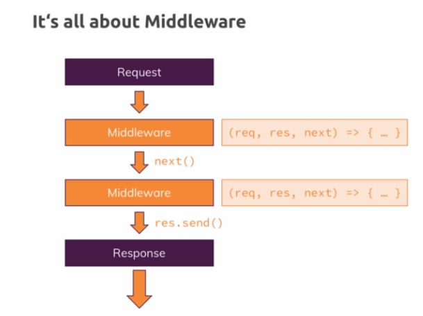

```js
const express = require("express")

const app = express();
app.use((req,res,next) => {
    console.log("this is 1 middleware")
    next() // move to next middleware
})
app.use((req,res,next) => {
    console.log("this is 2 middleware")
    res.send('<h1>Hello</h1>') // return the respone to the client, default is html content type
    // request end here
})
app.listen(3000)
```


# Parse request body

```js
const express = require("express")
const bodyParser = require("body-parser")

const app = express();
app.use(bodyParser.urlencoded({extened: false}));

app.use("/product", (req,res) => {
    const { title } = req.body;
    res.send(`<h1> ${title} page</h1>`)
})
app.listen(3000)
```

# Routes

`app.use([path],callback[,callback...]) `(Only GET, order of middleware matter)

```js
app.use("/", (req,res,next) => {
    console.log("all request come here")
    next() // move to next middleware
})
app.use("/product", (req,res/*, next no need here*/) => {
    res.send("<h1>product page</h1>")
})
app.use("/", (req,res/*, next no need here*/) => {
    res.send("<h1>home page</h1>")
})
```

`app.get()` `app.post()`  (Exact path, order of middleware none matter)

```js
app.use("/", (req,res,next) => {
    console.log("all request come here")
    next() // move to next middleware
})
app.post("/product", (req,res/*, next no need here*/) => {
    console.log(req.body)
    res.redirect("/");
})
app.get("/", (req,res/*, next no need here*/) => {
    res.send("<h1>home page</h1>")
})
```


## outsourcing routes

```js
// routes/admin.js
const express = require('express');

const router = express.Router();

router.get('/add-product', (req, res, next) => {
  res.send(
    '<form action="/product" method="POST"><input type="text" name="title"><button type="submit">Add Product</button></form>'
  );
});

router.post('/product', (req, res, next) => {
  console.log(req.body);
  res.redirect('/');
});

module.exports = router;
// routes/shop.js
const express = require('express');

const router = express.Router();

router.get('/', (req, res, next) => {
  res.send('<h1>Hello from Express!</h1>');
});

module.exports = router;
// app.js
const express = require('express');
const bodyParser = require('body-parser');

const app = express();

const adminRoutes = require('./routes/admin');
const shopRoutes = require('./routes/shop');

app.use(bodyParser.urlencoded({extended: false}));

app.use(adminRoutes);
app.use(shopRoutes);

app.use((req,res,next) => {
    res.status(400).send('<h1>Page not found</h1>')
})
app.listen(3000);
```

## filter routes

```js
app.use("/admin", adminRoutes);
/*
	only /admin/add-product or /admin/product will be handled
*/
```

## 404 page

```js
//blah blah 
//end of all valid middleware
app.use((req,res,next) => {
    res.status(400).send('<h1>Page not found</h1>')
})
app.listen(3000);
```

# Authentication


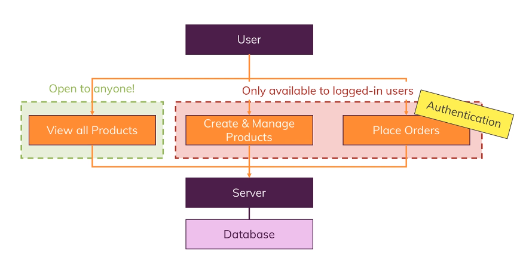


## Encrypting password

### bcryptjs


## protected route


## Resetting password

create and store a reset token (with expire date) to verify that user need reset password


# Authorization

restrict permission of a login user

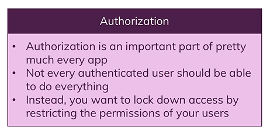


# Validation


## Error message

https://stackoverflow.com/questions/47176945/difference-between-flash-connect-flash-and-express-flash


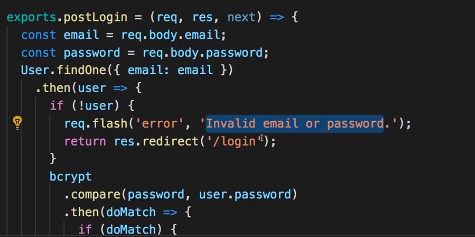


## express-validator

https://express-validator.github.io/docs/

https://github.com/chriso/validator.js

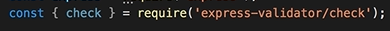


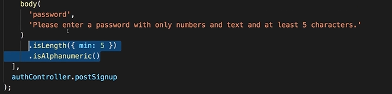

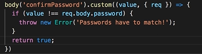

async validator

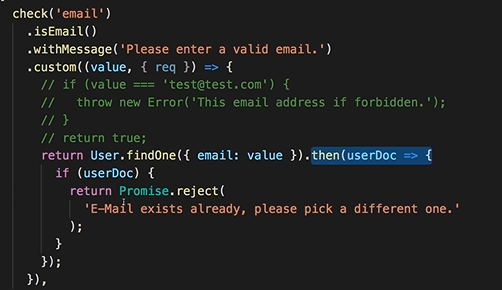


store old input

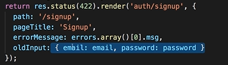

sanitizing data


# Error handling

https://expressjs.com/en/guide/error-handling.html

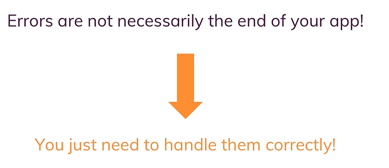


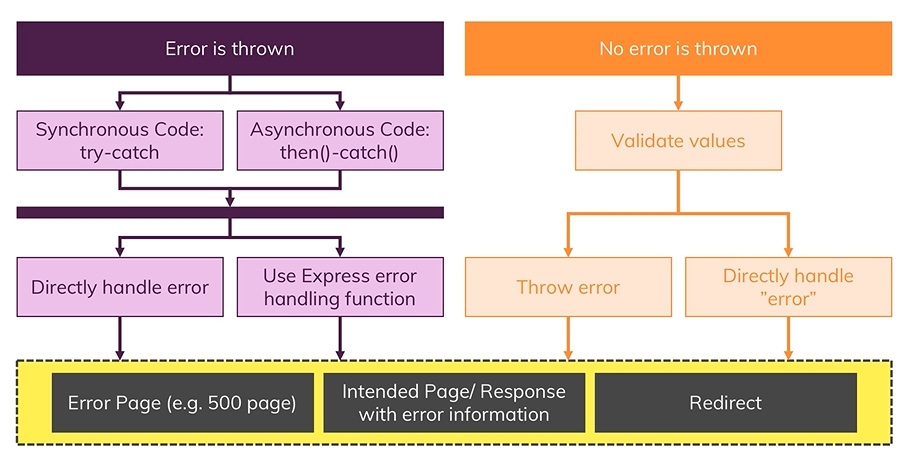


## Status

https://developer.mozilla.org/en-US/docs/Web/HTTP/Status

https://httpstatuses.com/


## Error page

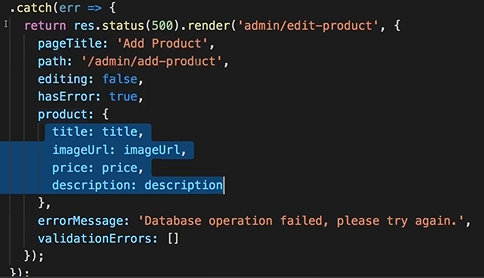

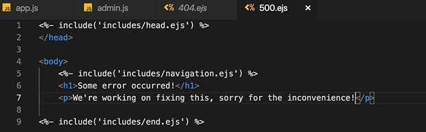


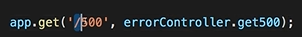

## Error middleware

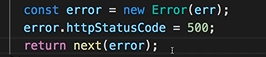

```js
(req,res,next) => {
    throw new Error("balh") // => will go to error middleware if throw sync place
    //promise.then(/*blah*/).catch(err => throw new Error(err)) // not working because in async
    promise.then(/*blah*/).catch(err => next(err)) // this will work
}
```


# Data sharing

persisting data across request

## request

```js
(res,req) => {
    req.someData = "some data"
    req.locals.viewData = "some data will be passed to the views"
    next()
}
```

## params

`/products/:id` (/product/123)

=> id = 123

```js
router.get("/products/:id",(res,req) => {
    const prodId = req.params.id
})
```

## query params

`/products/:id?edit=true`

```js
router.get("/products/:id",(res,req) => {
    const isEdit = req.query.edit
})
```

## cookie

https://developer.mozilla.org/en-US/docs/Web/HTTP/Cookies


user can simply manipulating cookie value => use to store value to tracking users, advertisements tracking, not store sensitive data

can send to another page (**Third-party cookies**)

## sessions

https://www.quora.com/What-is-a-session-in-a-Web-Application

entry store in database or in memory of server

connect separate request of an user


=> data in session will be protected in server-side, cannot change in client-side, only for a client session

A client need to tell the server which sessions he belongs by send to server a hashed session id which is encrypted and only server can confirm that value is a certain ID in it's session store

## cookies vs sessions


# Serving file

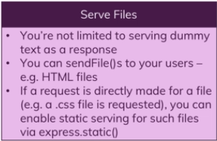

## serving views

```js
// routes/shop.js
const path = require('path');

const express = require('express');

const router = express.Router();

router.get('/', (req, res, next) => {
	res.sendFile(path.join(__dirname,"..","views","shop.html")) // ./views/shop.html
});

module.exports = router;
// app.js
// blah blah 
app.use((req,res,next) => {
    res.status(400).send(path.join(__dirname,"views","404.html")) // ./views/404.html
})
app.listen(3000);
```

## static (public)

```js
//app.js
app.use(express.static(path.join(__dirname,"public")) //public => css, image, video, ... blah blah
```

```html
<link rel="stylesheet" href="/css/main.css"></link>
```


url.com/image.png


url.com/images/image.png


server relative path


## privately file


## readFile

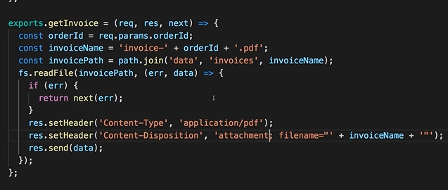

check file access


## file stream

https://medium.freecodecamp.org/node-js-streams-everything-you-need-to-know-c9141306be93

we can pipe our readable stream, the file stream into the response and that means that the data will basically be downloaded by the browser step by step

if this is a large file, that will be a huge advantages because server never has to pre-loading file data to the memory but just **streams it to the client on the fly** and just has to store a **chunk** of date

here we don't wait for all the chunks to come together and concatenate them into one object, instead we forward them to the browser which then is also able to concatenate the incoming data pieces 


## pdf on the fly

### pdfkit

http://pdfkit.org/docs/getting_started.html

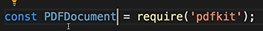


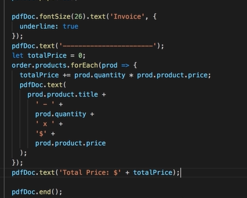


# File upload

https://github.com/expressjs/multer

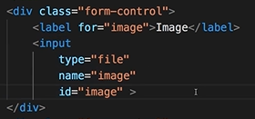

## multer

parse multi part (file, text, ... mixed ) data of request 

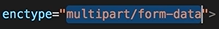


test multer


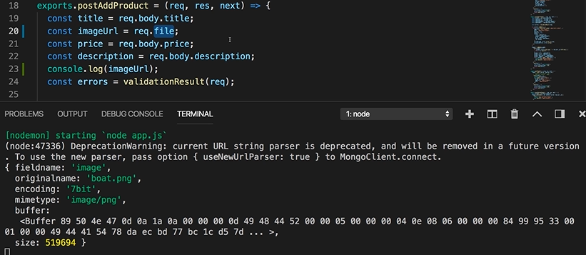


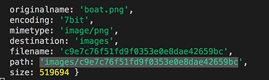

best practice setup

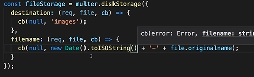

filter

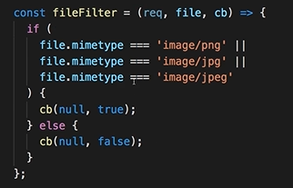

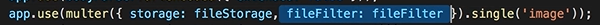

handler file data


## Image Names & Windows

One **important** note for **Windows users only**:

On Windows, the file name that includes a date string is not really supported and will lead to some strange CORS errors. Adjust your code like this to avoid such errors:

Instead of

```js
const storage = multer.diskStorage({    
    destination: function(req, file, cb) {        
        cb(null, 'images');    
    },    
    filename: function(req, file, cb) {        
        cb(null, new Date().toISOString() + file.originalname);    
    }
});
```

which we'll write in the next lecture, you should use this slightly modified version:

```js
const uuidv4 = require('uuid/v4') 
const storage = multer.diskStorage({    
    destination: function(req, file, cb) {        
        cb(null, 'images');    
    },    
    filename: function(req, file, cb) {        
        cb(null, uuidv4())    
    }
});
```

To ensure that images can be loaded correctly on the frontend, you should also change the logic in the `feed.js` controller:

```js
exports.createPost = (req, res, next) => {    
    //...    
    const imageUrl = req.file.path.replace("\\" ,"/");    
    //...
}
```

On macOS and Linux, you can ignore that and stick to the code I show in the videos.

# Email

https://sendgrid.com/docs/


## nodemailer

https://nodemailer.com/about/


### nodemailer-sendgrid-transport

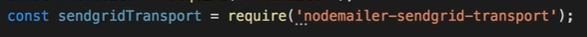


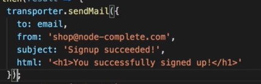

# pagination


## mongoose


## sequelize

https://bezkoder.com/node-js-sequelize-pagination-mysql/

https://stackoverflow.com/questions/38211170/sequelize-pagination

## sql

https://stackoverflow.com/questions/3799193/mysql-data-best-way-to-implement-paging

## prepare data

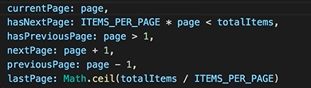

## front-end

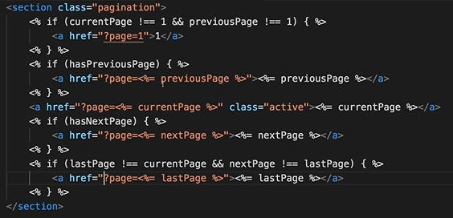

# Security


## CSRF

https://www.acunetix.com/websitesecurity/csrf-attacks/

CSRF ( Cross Site Request Forgery) abuse server session and trick user execute malicious code. 

=> Protect: only let session available on your views


### csurf


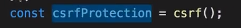


=> this package will look for the existence of a csrf token in your views, in your request body

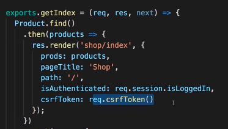

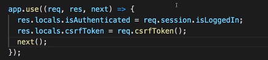

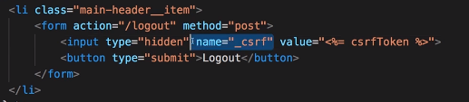

# payment

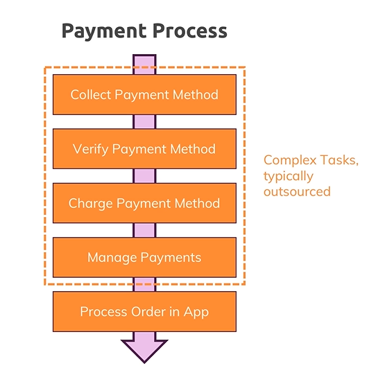

## Stripe

https://stripe.com/docs

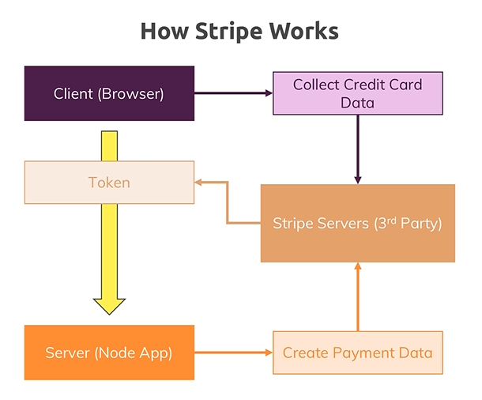


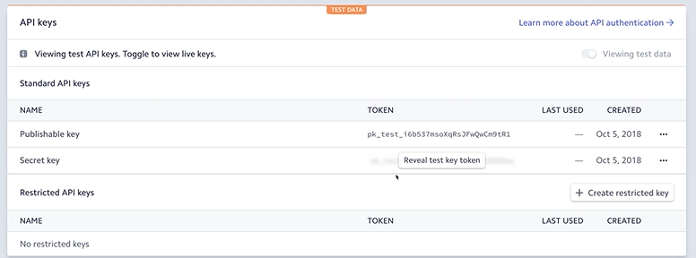

sever

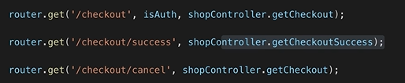

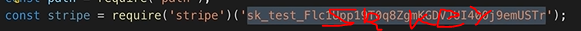


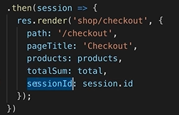

client

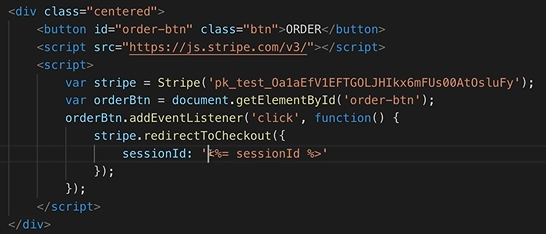


# Best practice

## rootDir

```js
const path = require('path');
module.exports = path.dirname(process.mainModule.filename) // app.js
```


