# MVC

https://developer.mozilla.org/en-US/docs/Glossary/MVC

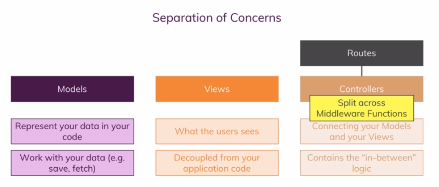

# Template engine

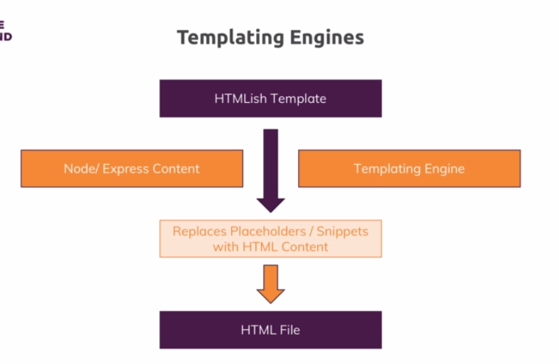

dynamic HTML page create by server data on the fly

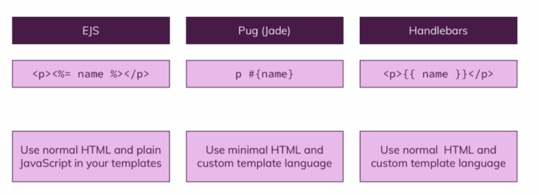

## installing

`npm isntall --save ejs pug express-handlebars`

## implementing

```js
//app.js
//pug
app.set('views engine', 'pug');
app.set('views', 'views');
//express-handlebars
const expressHbs = require('express-handlebars');
app.engine('hbs',expressHbs({
    layoutsDir: "views/layout",
    defaultLayout: "main",
    extname: "hbs"
}));
app.set('views engine', 'hbs');
app.set('views', 'views');
//ejs
app.set('views engine', 'ejs');
app.set('views', 'views');
```

## dynamic content

```js
//controler.js
const products = [/*blah blah*/]
const controller = (req,res) => {
    res.render('shop', { products, title: 'shop', path: "/", hasProduct: products.length > 0}) // ./views/shop.pug (hbs, ejs) 
}
```

### pug

https://pugjs.org/api/getting-started.html

```jade
head
	title #{title}
body
	main
		if products.length > 0 
            each product in products
                div.product 
                    div.title #{product.title}
          else
          	h1 no product
```

layout

```jade
//./views/layout/main.pug
<!DOCTYPE html>
html(lang="en")
	head
		title #{title}
		block styles
	body
        header
            nav
                ul
                    li
                        a(herf="/", class=(path === "/" ? 'active' : ""))
                    li
                        a(herf="/products", class=(path === "/products" ? 'active' : ""))
		block content
		
//./views/404.pug
extends layout/main.pug
block content
	h1 Page not found
```

### handlebars

no logic inside template => logic in the controller

```handlebars
<!DOCTYPE html>
<html>
	<head>
    	<title>{{ title }}</title>
    </head>   
 	<body>
        {{#if hasProduct}}
        	{{#each products}}
        		<div class="product">
        			<div class="title">
        				{{ this.title }}
        			</div>
        		</div>
        	{{/each}}
        {{else}}
        	<h1>no product</h1>
        {{/if}}	
    </body>
</html>
```

layout

```handlebars
//./views/layout/main.hbs
<!DOCTYPE html>
<html>
	<head>
    	<title>{{ title }}</title>
    	{{#if someCSS}}
    		<link rel="stylesheet" href="/css/some.css">
    	{{/if}}
    </head>   
 	<body>
 		<header>
 			<ul>
 			   <li><a class="{{#if activeShop}}active{{/if}}" href="/">Home</a></li>
             	<li><a class="{{#if activeProduct}}active{{/if}}" href="/product">Product</a></li>
 			</ul>
 		</header>
        {{{ body }}}
    </body>
</html>
//./views/produt.hbs auto use default layout
<main>
	{{#if hasProduct}}
        {{#each products}}
        	<div class="product">
        		<div class="title">
        			{{ this.title }}
        		</div>
        	</div>
        {{/each}}
	{{else}}
        <h1>no product</h1>
	{{/if}}	
</main>
```

### ejs

```ejs
<!DOCTYPE html>
<html>
	<head>
    	<title><%= title %></title>
    </head>   
 	<body>
        <%= if (products.length > 0) { %>
        	<%= for(let product of products) %>
        		<div class="product">
        			<div class="title">
        				<%= product.title %> 
        			</div>
        		</div>
        	<%= } %>
        <%= } else { %>
            <h1>no product</h1>
       	<%= } %>
    </body>
</html>
```

include

```ejs
//./views/include/header.ejs
<header>
	<ul>
		<li><a class="<%= path === "/" ? 'active' : "" %>" href="/">Home</a></li>
		<li><a class="<%= path === "/product" ? 'active' : "" %>" href="/product">Product</a></li>
	</ul>
</header>
//./views/includes/head.ejs
<!DOCTYPE html>
<html>
	<head>
    	<title><%= title %></title>
        
//./views/404.ejs
<%- include('includes/head.ejs') %>
    </head>
    <body>
        <%- include('includes/header.ejs') %>
        <h1>
            page not found
        </h1>
    </body>
</html>
```


## request

```js
(res,req) => {
    req.someData = "some data"
    req.locals.viewData = "some data will be passed to the views"
    next()
}
```

# cookie

https://developer.mozilla.org/en-US/docs/Web/HTTP/Cookies


user can simply manipulating cookie value => use to store value to tracking users, advertisements tracking, not store sensitive data

can send to another page (**Third-party cookies**)

expired-in

max-age (default is a session)

secured

httpOnly

## set

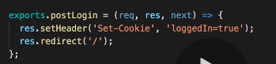

## get


# sessions

https://www.quora.com/What-is-a-session-in-a-Web-Application

entry store in database or in memory of server

connect separate request of an user

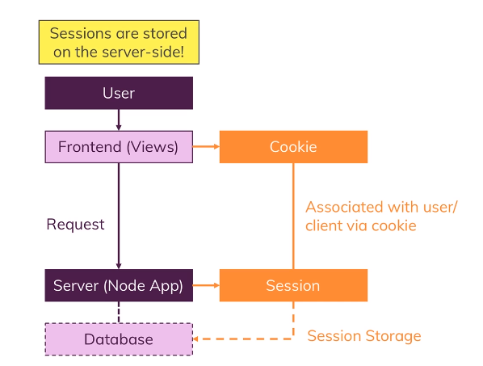

=> data in session will be protected in server-side, cannot change in client-side, only for a client session

A client need to tell the server which sessions he belongs by send to server a hashed session id which is encrypted and only server can confirm that value is a certain ID in it's session store

## express-session

https://github.com/expressjs/session

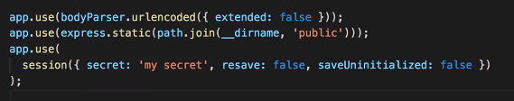


## connect-mongodb-session

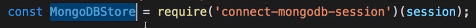

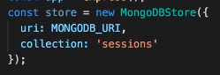

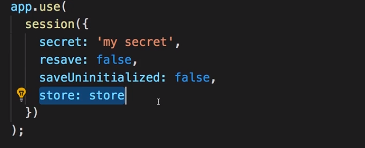

## delete cookie

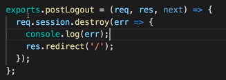

# cookies vs sessions

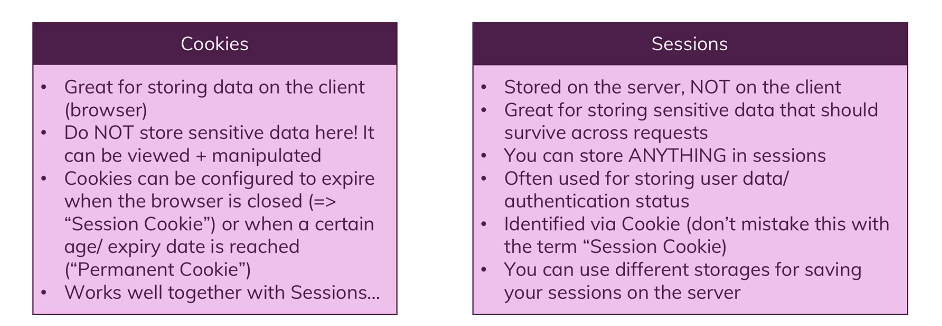