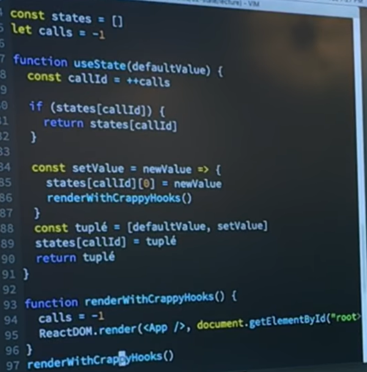
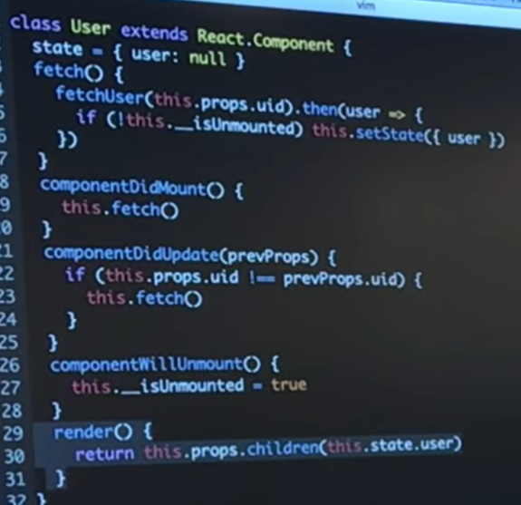
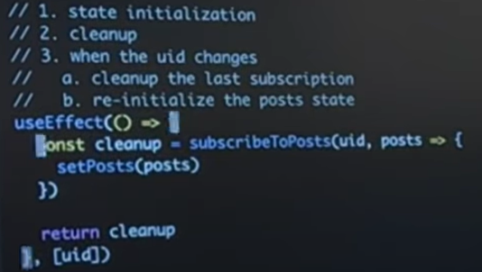
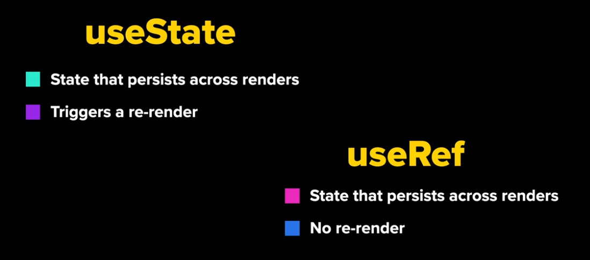

# Hooks

https://www.youtube.com/watch?v=unFHsn0qSMA&list=PLeS7aZkL6GOsHNoyeEpeL8B1PnbKoQD9m&index=1

https://reactjs.org/docs/hooks-reference.html

https://reactjs.org/docs/hooks-faq.html

https://medium.com/@dan_abramov/making-sense-of-react-hooks-fdbde8803889

https://www.youtube.com/watch?v=dpw9EHDh2bM

https://daveceddia.com/useeffect-hook-examples/

https://medium.com/@guptagaruda/react-hooks-understanding-component-re-renders-9708ddee9928

https://medium.com/@sdolidze/the-iceberg-of-react-hooks-af0b588f43fb

https://medium.com/the-guild/under-the-hood-of-reacts-hooks-system-eb59638c9dba

https://www.youtube.com/watch?v=1jWS7cCuUXw

https://www.youtube.com/watch?v=dpw9EHDh2bM


hooks are meaningless if not called in the right context

## The dispatcher

The dispatcher is the shared object that contains the hook functions. It will be dynamically allocated or cleaned up based on the rendering phase of ReactDOM, and it will ensure that the user doesn’t access hooks outside a React component (see [implementation](https://github.com/facebook/react/tree/5f06576f51ece88d846d01abd2ddd575827c6127/packages/react-reconciler/src/ReactFiberDispatcher.js#L24)).

When we’re done performing the rendering work, we nullify the dispatcher and thus preventing hooks from being accidentally used outside ReactDOM’s rendering cycle. This is a mechanism that will ensure that the user doesn’t do silly things (see [implementation](https://github.com/facebook/react/tree/5f06576f51ece88d846d01abd2ddd575827c6127/packages/react-reconciler/src/ReactFiberScheduler.js#L1376)).

The dispatcher is resolved in each and every hook call using a function called `resolveDispatcher()`. Outside the rendering cycle of React this should be meaningless, and React should print the warning message: *“Hooks can only be called inside the body of a function component”* (see [implementation](https://github.com/facebook/react/tree/5f06576f51ece88d846d01abd2ddd575827c6127/packages/react/src/ReactHooks.js#L17)).

```jsx
let currentDispatcher
const dispatcherWithoutHooks = { /* ... */ }
const dispatcherWithHooks = { /* ... */ }

function resolveDispatcher() {
  if (currentDispatcher) return currentDispatcher
  throw Error("Hooks can't be called")
}

function useXXX(...args) {
  const dispatcher = resolveDispatcher()
  return dispatcher.useXXX(...args)
}

function renderRoot() {
  currentDispatcher = enableHooks ? dispatcherWithHooks : dispatcherWithoutHooks
  performWork()
  currentDispatcher = null
}
```

## The hooks queue

Behind the scenes, hooks are represented as nodes which are linked together in their calling order.

> They’re represented like so because hooks are not simply created and then left alone. They have a mechanism which allows them to be what they are. A hook has several properties which I would like you to bare in mind before diving into its implementation:
>
> - Its initial state is created in the initial render.
> - Its state can be updated on the fly.
> - React would remember the hook’s state in future renders.
> - React would provide you with the right state based on the calling order.
> - React would know which fiber does this hook belong to.

But when dealing with hooks state should be viewed as a queue, where each node represents a single model of the state

The schema of a single hook node can be viewed in the [implementation](https://github.com/facebook/react/tree/5f06576f51ece88d846d01abd2ddd575827c6127/packages/react-reconciler/src/ReactFiberHooks.js#L243).

```jsx
{
  memoizedState: 'foo',
  next: {
    memoizedState: 'bar',
    next: {
      memoizedState: 'bar',
      next: null
    }
  }
}
```

before each and every function Component invocation, a function named `prepareHooks()` is gonna be called, where the current fiber and its first hook node in the hooks queue are gonna be stored in global variables. This way, any time we call a hook function (`useXXX()`) it would know in which context to run.

```jsx

let currentlyRenderingFiber
let workInProgressQueue
let currentHook

// Source: https://github.com/facebook/react/tree/5f06576f51ece88d846d01abd2ddd575827c6127/react-reconciler/src/ReactFiberHooks.js:123
function prepareHooks(recentFiber) {
  currentlyRenderingFiber = workInProgressFiber
  currentHook = recentFiber.memoizedState
}

// Source: https://github.com/facebook/react/tree/5f06576f51ece88d846d01abd2ddd575827c6127/react-reconciler/src/ReactFiberHooks.js:148
function finishHooks() {
  currentlyRenderingFiber.memoizedState = workInProgressHook
  currentlyRenderingFiber = null
  workInProgressHook = null
  currentHook = null
}

// Source: https://github.com/facebook/react/tree/5f06576f51ece88d846d01abd2ddd575827c6127/react-reconciler/src/ReactFiberHooks.js:115
function resolveCurrentlyRenderingFiber() {
  if (currentlyRenderingFiber) return currentlyRenderingFiber
  throw Error("Hooks can't be called")
}
// Source: https://github.com/facebook/react/tree/5f06576f51ece88d846d01abd2ddd575827c6127/react-reconciler/src/ReactFiberHooks.js:267
function createWorkInProgressHook() {
  workInProgressHook = currentHook ? cloneHook(currentHook) : createNewHook()
  currentHook = currentHook.next
  workInProgressHook
}

function useXXX() {
  const fiber = resolveCurrentlyRenderingFiber()
  const hook = createWorkInProgressHook()
  // ...
}

function updateFunctionComponent(recentFiber, workInProgressFiber, Component, props) {
  prepareHooks(recentFiber, workInProgressFiber)
  Component(props)
  finishHooks()
}
```

Once an update has finished, a function named `finishHooks()` will be called, where a reference for the first node in the hooks queue will be stored on the rendered fiber in the `memoizedState` property. This means that the hooks queue and their state can be addressed externally:

```jsx
const ChildComponent = () => {
  useState('foo')
  useState('bar')
  useState('baz')

  return null
}

const ParentComponent = () => {
  const childFiberRef = useRef()

  useEffect(() => {
    let hookNode = childFiberRef.current.memoizedState

    assert(hookNode.memoizedState, 'foo')
    hookNode = hooksNode.next
    assert(hookNode.memoizedState, 'bar')
    hookNode = hooksNode.next
    assert(hookNode.memoizedState, 'baz')
  })

  return (
    <ChildComponent ref={childFiberRef} />
  )
}
```


## States hooks

but behind the scenes the `useState` hook uses `useReducer` and it simply provides it with a pre-defined reducer handler (see [implementation](https://github.com/facebook/react/blob/5f06576f51ece88d846d01abd2ddd575827c6127/packages/react-reconciler/src/ReactFiberHooks.js#L339)). This means that the results returned by `useState` are actually a reducer state, and an action dispatcher.

So as expected, we can provide the action dispatcher with the new state directly; but would you look at that?! We can also provide the dispatcher with *an action function that will receive the old state and return the new one.*

This means that when you send the state setter down the component tree you can run mutations against the current state of the parent component, without passing it as a different prop. For example:

```jsx

const ParentComponent = () => {
  const [name, setName] = useState()
  
  return (
    <ChildComponent toUpperCase={setName} />
  )
}

const ChildComponent = (props) => {
  useEffect(() => {
    props.toUpperCase((state) => state.toUpperCase())
  }, [true])
  
  return null
}
```

## Effect hooks

- They’re created during render time, but they run *after* painting.
- If given so, they’ll be destroyed right before the next painting.
- They’re called in their definition order.

Accordingly, there should be another an additional queue that should hold these effects and should be addressed after painting. Generally speaking, a fiber holds a queue which contains effect nodes. Each effect is of a different type and should be addressed at its appropriate phase:

- Invoke instances of `getSnapshotBeforeUpdate()` before mutation (see [implementation](https://github.com/facebook/react/tree/5f06576f51ece88d846d01abd2ddd575827c6127/packages/react-reconciler/src/ReactFiberScheduler.js#L646)).
- Perform all the host insertions, updates, deletions and ref unmounts (see [implementation](https://github.com/facebook/react/tree/5f06576f51ece88d846d01abd2ddd575827c6127/packages/react-reconciler/src/ReactFiberScheduler.js#L687)).
- Perform all life-cycles and ref callbacks. Life-cycles happen as a separate pass so that all placements, updates, and deletions in the entire tree have already been invoked. This pass also triggers any renderer-specific initial effects (see [implementation](https://github.com/facebook/react/tree/5f06576f51ece88d846d01abd2ddd575827c6127/packages/react-reconciler/src/ReactFiberScheduler.js#L732)).
- Effects which were scheduled by the `useEffect()` hook - which are also known as “passive effects” based on the [implementation](https://github.com/facebook/react/tree/5f06576f51ece88d846d01abd2ddd575827c6127/packages/react-reconciler/src/ReactFiberScheduler.js#L779)

When it comes to the hook effects, they should be stored on the fiber in a property called `updateQueue`, and each effect node should have the following schema (see [implementation](https://github.com/facebook/react/tree/5f06576f51ece88d846d01abd2ddd575827c6127/packages/react-reconciler/src/ReactFiberHooks.js#L477)):

- `tag` - A binary number which will dictate the behavior of the effect (`useMutationEffect()`(legacy), `useLayoutEffect()`,`useEffect()`)(see [implementation](https://github.com/facebook/react/tree/5f06576f51ece88d846d01abd2ddd575827c6127/packages/react-reconciler/src/ReactHookEffectTags.js)).
- `create` - The callback that should be ran *after* painting.
- `destroy` - The callback returned from `create()` that should be ran *before* the initial render.
- `inputs` - A set of values that will determine whether the effect should be destroyed and recreated.
- `next` - A reference to the next effect which was defined in the function Component.

we can actually inject an effect to a certain fiber externally:

```jsx
function injectEffect(fiber) {
  const lastEffect = fiber.updateQueue.lastEffect

  const destroyEffect = () => {
    console.log('on destroy')
  }

  const createEffect = () => {
    console.log('on create')

    return destroy
  }

  const injectedEffect = {
    tag: 0b11000000,
    next: lastEffect.next,
    create: createEffect,
    destroy: destroyEffect,
    inputs: [createEffect],
  }

  lastEffect.next = injectedEffect
}

const ParentComponent = (
  <ChildComponent ref={injectEffect} />
)
```

# Rule of hooks

https://reactjs.org/docs/hooks-rules.html

https://stackoverflow.com/questions/58866796/understanding-the-react-hooks-exhaustive-deps-lint-rule

## Only Call Hooks at the Top Level

**Don’t call Hooks inside loops, conditions, or nested functions.**

## Only Call Hooks from React Functions

**Don’t call Hooks from regular JavaScript functions.** Instead, you can:

- ✅ Call Hooks from React function components.
- ✅ Call Hooks from custom Hooks

# Build-in hooks

https://codesandbox.io/s/z3ow32rk43

https://leewarrick.com/blog/react-use-effect-explained/

https://overreacted.io/a-complete-guide-to-useeffect/

https://stackoverflow.com/questions/59709304/setstate-in-reacts-useeffect-dependecy-array

https://stackoverflow.com/questions/55228102/react-hook-useeffect-dependency-array

https://reacttraining.com/blog/when-to-use-functions-in-hooks-dependency-array/

https://medium.com/better-programming/understanding-the-useeffect-dependency-array-2913da504c44

https://www.robinwieruch.de/react-ref

https://medium.com/trabe/react-useref-hook-b6c9d39e2022

https://dev.to/dinhhuyams/introduction-to-useref-hook-3m7n

https://medium.com/better-programming/how-to-properly-use-the-react-useref-hook-in-concurrent-mode-38c54543857b

https://kentcdodds.com/blog/useeffect-vs-uselayouteffect

https://stackoverflow.com/questions/53513872/react-hooks-what-is-the-difference-between-usemutationeffect-and-uselayoutef

## useState

> useState give us a value persist across renders and a function to change value and trigger re-render



## useEffect

[A Complete Guide to useEffect — Overreacted](https://overreacted.io/a-complete-guide-to-useeffect)

https://topdev.vn/blog/useeffect-tu-a-toi-z/






> this runs *after* react render is committed to the screen  and ensures that your effect callback does not block browser painting, i.e. after Layout and Paint phase. Use this whenever possible to avoid blocking visual updates
>
>  if your effect is mutating the DOM (via a DOM node ref) ***and\*** the DOM mutation will change the appearance of the DOM node between the time that it is rendered and your effect mutates it, then you **don't** want to use `useEffect`. You'll want to use `useLayoutEffect`. Otherwise the user could see a flicker when your DOM mutations take effect. **This is pretty much the only time you want to avoid `useEffect` and use `useLayoutEffect` instead.**

https://reactjs.org/docs/hooks-faq.html#is-it-safe-to-omit-functions-from-the-list-of-dependencies

Mutations, subscriptions, timers, logging, and other side effects are not allowed inside the main body of a function component (referred to as React’s *render phase*). Doing so will lead to confusing bugs and inconsistencies in the UI.

Instead, use `useEffect`.Think of effects as an escape hatch from React’s purely functional world into the imperative world.

By default, The function passed to `useEffect` will run after the render is committed to the screen, but you can choose to fire them only when certain values have changed

### Cleaning up an effect

```jsx
useEffect(() => {
  const subscription = props.source.subscribe();
  return () => {
    // Clean up the subscription
    subscription.unsubscribe();
  };
});
```

The clean-up function runs before the component is removed from the UI to prevent memory leaks.

Additionally, if a component renders multiple times (as they typically do), the **previous effect is cleaned up before executing the next effect**. In our example, this means a new subscription is created on every update. To avoid firing an effect on every update, refer to the next section.

#### Timing of effects

Unlike `componentDidMount` and `componentDidUpdate`, the function passed to `useEffect` fires **after** layout and paint, during a deferred (waiting) event.

However, not all effects can be deferred. For example, a DOM mutation that is visible to the user must fire synchronously before the next paint so that the user does not perceive a visual inconsistency. (The distinction is conceptually similar to passive versus active event listeners.) For these types of effects, React provides one additional Hook called [`useLayoutEffect`](https://reactjs.org/docs/hooks-reference.html#uselayouteffect). It has the same signature as `useEffect`, and only differs in when it is fired.

Although `useEffect` is deferred until after the browser has painted, it’s guaranteed to fire before any new renders. React will always flush a previous render’s effects before starting a new update.

#### Conditionally firing an effect

The default behavior for effects is to fire the effect after every completed render. That way an effect is always recreated if one of its dependencies changes.

To implement this, pass a second argument to `useEffect` that is the array of values that the effect depends on. Our updated example now looks like this:

```jsx
useEffect(
  () => {
    const subscription = props.source.subscribe();
    return () => {
      subscription.unsubscribe();
    };
  },
  [props.source],
);
```

## useContext

```jsx
const value = useContext(MyContext);
```

Accepts a context object (the value returned from `React.createContext`) and returns the current context value for that context. The current context value is determined by the `value` prop of the nearest `<MyContext.Provider>` above the calling component in the tree.

When the nearest `<MyContext.Provider>` above the component updates, this Hook will trigger a rerender with the latest context `value` passed to that `MyContext` provider. Even if an ancestor uses [`React.memo`](https://reactjs.org/docs/react-api.html#reactmemo) or [`shouldComponentUpdate`](https://reactjs.org/docs/react-component.html#shouldcomponentupdate), a rerender will still happen starting at the component itself using `useContext`.

Don’t forget that the argument to `useContext` must be the *context object itself*:

- **Correct:** `useContext(MyContext)`
- **Incorrect:** `useContext(MyContext.Consumer)`
- **Incorrect:** `useContext(MyContext.Provider)`

A component calling `useContext` will always re-render when the context value changes. If re-rendering the component is expensive, you can [optimize it by using memoization](https://github.com/facebook/react/issues/15156#issuecomment-474590693).

> If you’re familiar with the context API before Hooks, `useContext(MyContext)` is equivalent to `static contextType = MyContext` in a class, or to `<MyContext.Consumer>`.
>
> `useContext(MyContext)` only lets you *read* the context and subscribe to its changes. You still need a `<MyContext.Provider>` above in the tree to *provide* the value for this context.

**Putting it together with Context.Provider**

```jsx
const themes = {
  light: {
    foreground: "#000000",
    background: "#eeeeee"
  },
  dark: {
    foreground: "#ffffff",
    background: "#222222"
  }
};

const ThemeContext = React.createContext(themes.light);

function App() {
  return (
    <ThemeContext.Provider value={themes.dark}>
      <Toolbar />
    </ThemeContext.Provider>
  );
}

function Toolbar(props) {
  return (
    <div>
      <ThemedButton />
    </div>
  );
}

function ThemedButton() {
  const theme = useContext(ThemeContext);  return (    <button style={{ background: theme.background, color: theme.foreground }}>      I am styled by theme context!    </button>  );
}
```

## useReducer

## useCallback

## useMemo

## useRef

> persist value and no need to notify re-render

https://www.youtube.com/watch?v=ZGL9XiveFHs

https://medium.com/trabe/react-useref-hook-b6c9d39e2022

```jsx
const refContainer = useRef(initialValue);
```

`useRef` returns a mutable ref object whose `.current` property is initialized to the passed argument (`initialValue`). **The returned object will persist for the full lifetime of the component.**

https://reactjs.org/docs/hooks-faq.html#is-there-something-like-instance-variables

https://reactjs.org/docs/refs-and-the-dom.html

```jsx
function TextInputWithFocusButton() {
  const inputEl = useRef(null);
  const onButtonClick = () => {
    // `current` points to the mounted text input element
    inputEl.current.focus();
  };
  return (
    <>
      <input ref={inputEl} type="text" />
      <button onClick={onButtonClick}>Focus the input</button>
    </>
  );
}
```

Essentially, `useRef` is like a “box” that can hold a mutable value in its `.current` property.

You might be familiar with refs primarily as a way to [access the DOM](https://reactjs.org/docs/refs-and-the-dom.html). If you pass a ref object to React with `<div ref={myRef} />`, React will set its `.current` property to the corresponding DOM node whenever that node changes.

This works because `useRef()` creates a plain JavaScript object. The only difference between `useRef()` and creating a `{current: ...}` object yourself is that `useRef` will give you the same ref object on every render.

Keep in mind that `useRef` *doesn’t* notify you when its content changes. Mutating the `.current` property doesn’t cause a re-render. If you want to run some code when React attaches or detaches a ref to a DOM node, you may want to use a [callback ref](https://reactjs.org/docs/hooks-faq.html#how-can-i-measure-a-dom-node) instead.

### avoid re-creating the `useRef()` initial value.

```jsx
function Image(props) {
  // ⚠️ IntersectionObserver is created on every render
  const ref = useRef(new IntersectionObserver(onIntersect));
  // ...
}
```

`useRef` **does not** accept a special function overload like `useState`. Instead, you can write your own function that creates and sets it lazily:

```jsx
function Image(props) {
  const ref = useRef(null);

  // ✅ IntersectionObserver is created lazily once
  function getObserver() {
    if (ref.current === null) {
      ref.current = new IntersectionObserver(onIntersect);
    }
    return ref.current;
  }

  // When you need it, call getObserver()
  // ...
}
```

This avoids creating an expensive object until it’s truly needed for the first time. If you use Flow or TypeScript, you can also give `getObserver()` a non-nullable type for convenience.

## useImperativeHandle

```jsx
useImperativeHandle(ref, createHandle, [deps])
```

`useImperativeHandle` customizes the instance value that is exposed to parent components when using `ref`. As always, imperative code using refs should be avoided in most cases. `useImperativeHandle` should be used with [`forwardRef`](https://reactjs.org/docs/react-api.html#reactforwardref):

```jsx
function FancyInput(props, ref) {
  const inputRef = useRef();
  useImperativeHandle(ref, () => ({
    focus: () => {
      inputRef.current.focus();
    }
  }));
  return <input ref={inputRef} ... />;
}
FancyInput = forwardRef(FancyInput);
```

In this example, a parent component that renders `<FancyInput ref={inputRef} />` would be able to call `inputRef.current.focus()`.

## useLayoutEffect

> It fires synchronously after all DOM mutations but before Paint phase. Use this to read layout(styles or layout information) from the DOM and then perform blocking custom DOM mutations based on layout.
>
> This runs synchronously immediately after React has performed all DOM mutations.
>
> As far as scheduling, this works the same way as `componentDidMount` and `componentDidUpdate`. Your code runs immediately after the DOM has been updated, but before the browser has had a chance to "paint" those changes (the user doesn't actually see the updates until after the browser has repainted).

The signature is identical to `useEffect`, but it fires synchronously after all DOM mutations. Use this to read layout from the DOM and synchronously re-render. Updates scheduled inside `useLayoutEffect` will be flushed synchronously, before the browser has a chance to paint.

Prefer the standard `useEffect` when possible to avoid blocking visual updates.

> Tip
>
> If you’re migrating code from a class component, note `useLayoutEffect` fires in the same phase as `componentDidMount` and `componentDidUpdate`. However, **we recommend starting with `useEffect` first** and only trying `useLayoutEffect` if that causes a problem.
>
> If you use server rendering, keep in mind that *neither* `useLayoutEffect` nor `useEffect` can run until the JavaScript is downloaded. This is why React warns when a server-rendered component contains `useLayoutEffect`. To fix this, either move that logic to `useEffect` (if it isn’t necessary for the first render), or delay showing that component until after the client renders (if the HTML looks broken until `useLayoutEffect` runs).
>
> To exclude a component that needs layout effects from the server-rendered HTML, render it conditionally with `showChild && <Child />` and defer showing it with `useEffect(() => { setShowChild(true); }, [])`. This way, the UI doesn’t appear broken before hydration.

This can be useful if you need to make DOM measurements (like getting the scroll position or other styles for an element) and then make DOM mutations **or** trigger a synchronous re-render by updating state.

## useDebugValue

# Memoize Hooks vs Data hooks

Data Hooks are hooks that store data. Storing is different from memoizing/caching. You store data that a given portion UI directly relies on for visual changes and memoize/cache data that a given portion UI don’t directly rely on for visual changes.

`useState,useReducer,useEffect,useContext` are data hooks. 

`useCallback` and `useMemo` are memoize hooks.

`useRef` is a hook that can play both roles depending on how it’s used.

# Hooks vs re-render

https://www.codebeast.dev/usestate-vs-useref-re-render-or-not/

1. useState causes re-render; useRef does not.
2. Both useState and useRef remembers their data after a re-render

React re-renders to show us the changes we have requested through events, requests, timers, and so on. But they are not the actual triggers — state change is the actual trigger.



## Preserving data without re-rendering

```jsx
function App() {
  const [value, setValue] = React.useState("");
  const valueRef = React.useRef();

  const handleClick = e => {
    setValue(valueRef.current.value);
  };

  return (
    <div className="App">
      <h4>Value: {value}</h4>
      <input ref={valueRef} />
      <Button onClick={handleClick}>Button</Button>
    </div>
  );
}
```

=> The trick is that there’s no state item in the `value` of `input`, hence NO re-render will happen when we start filling the form.

> Uncontrolled components avoid preserving data in state but instead, preserve data in what React calls refs

# Memoize with Hooks

https://www.codebeast.dev/react-memoize-hooks-useRef-useCallback-useMemo/

https://medium.com/@sdolidze/react-hooks-memoization-99a9a91c8853

Memoize hooks need to remember data or functions that:

1. Might cause re-render when re-rendering is not needed
2. Preserve or cache data or function so new copies are not created.

 They remember during re-render

React.memo() => children compoents renders when props change

## useMemo

A callback “cache”, It prevents the function from being called again unless it’s parameters (or variables you specify) change

`useMemo` memoizes by taking a function that needs to be memoized and an array of values that when changed, would invalidate the memoization.

`useMemo` actually shines when you need to **memoize heavy computations** that would return the **same result** when given the **same value** or set of values.

## useCallback

```jsx
  const [count, setCount] = React.useState(0);
  const [anoutherCount, setAnotherCount] = React.useState(0);
    
  const incrementMemoizedCallback = React.useCallback(() => {
    setCount(count + 1);
  }, [count]);
  const decrementMemoizedCallback = React.useCallback(() => {
    setCount(count - 1);
  }, [count]);
```

What we are telling React to do to `count` buttons is:

“Hey, when `App` starts rendering, check if `count` has changed and only re-render the `count` buttons if `count` was updated. If only `anotherCount` changed, please ignore re-rendering these buttons.”

> ```javascript
> useCallback(() => {}, [dep,])
> ```
>
> is the same as:
>
> ```javascript
> useMemo(() => () => {}, [dep,])
> ```

## userRef

1. Stores data
2. accesses the DOM
3. **Does not cause re-render when the data it stores changes**
4. **Remembers its stored data even after state change in `useState` causes a re-render.**

```javascript
const decrementMemoizedCallback = React.useRef();
    
React.useEffect(() => {
  return decrementMemoizedCallback.current = () => {
    setCount(count + 1);
  }
}, [count]);
```

 Its ability to preserve data also makes it powerful for remembering the state of timing functions like setInterval, debounce, throttle, etc.

# Custom hooks

https://usehooks.com/

https://www.robinwieruch.de/react-hooks-fetch-data

A custom Hook is a JavaScript function whose name starts with ”`use`” and that may call other Hooks

All we did was to extract some common code between two functions into a separate function. 

**Custom Hooks are a convention that naturally follows from the design of Hooks, rather than a React feature.**

```jsx
import { useState, useEffect } from 'react';

function useFriendStatus(friendID) {  
   const [isOnline, setIsOnline] = useState(null);

  useEffect(() => {
    function handleStatusChange(status) {
      setIsOnline(status.isOnline);
    }

    ChatAPI.subscribeToFriendStatus(friendID, handleStatusChange);
    return () => {
      ChatAPI.unsubscribeFromFriendStatus(friendID, handleStatusChange);
    };
  });

  return isOnline;
}
```

## Using a Custom Hook

```jsx
function FriendStatus(props) {
  const isOnline = useFriendStatus(props.friend.id);

  if (isOnline === null) {
    return 'Loading...';
  }
  return isOnline ? 'Online' : 'Offline';
}
function FriendListItem(props) {
  const isOnline = useFriendStatus(props.friend.id);

  return (
    <li style={{ color: isOnline ? 'green' : 'black' }}>
      {props.friend.name}
    </li>
  );
}
```

**Do two components using the same Hook share state?** No. Custom Hooks are a mechanism to reuse *stateful logic* (such as setting up a subscription and remembering the current value), but every time you use a custom Hook, all state and effects inside of it are fully isolated.

**How does a custom Hook get isolated state?** Each *call* to a Hook gets isolated state. Because we call `useFriendStatus` directly, from React’s point of view our component just calls `useState` and `useEffect`.

## usePersitentValue

```jsx
import React, { useState, useEffect } from 'react';

function usePersitentValue(initValue) {
    return useState({current: initValue})[0]
}

function Counter() {
    const [count,setCount] = useState(0)
    const id = usePersitentValue(null)
    const clear = () => {
        window.clearInterval(id.current)
    }
    useEffect(() => {
        id.current = window.setInterval(() => {
            setCount((c) => c+1)
        })
    }, [])
    return (
    	<div>
            <h1>{count}</h1>
        	<button onClick={clear}>Stop</button>
        </div>
    )
}
```

## useInterval

https://overreacted.io/making-setinterval-declarative-with-react-hooks/

```jsx
import React, { useState, useEffect, useRef } from 'react';

function useInterval(callback, delay) {
  const savedCallback = useRef();

  // Remember the latest callback.
  useEffect(() => {
    savedCallback.current = callback;
  }, [callback]);

  // Set up the interval.
  useEffect(() => {
    function tick() {
      savedCallback.current();
    }
    if (delay !== null) {
      let id = setInterval(tick, delay);
      return () => clearInterval(id);
    }
  }, [delay]);
}
```

## Form with hooks

```jsx
const useForm = ({ initialValues, onSubmit, validate }) => {
  const [values, setValues] = React.useState(initialValues || {});
  const [touchedValues, setTouchedValues] = React.useState({});
  const [errors, setErrors] = React.useState({});
 // useReducer for a nicer logic
  const handleChange = event => {
    const target = event.target;
    const value = target.type === "checkbox" ? target.checked : target.value;
    const name = target.name;
    setValues({
      ...values,
      [name]: value
    });
  };

  const handleBlur = event => {
    const target = event.target;
    const name = target.name;
    setTouchedValues({
      ...touchedValues,
      [name]: true
    });
    const e = validate(values);
    setErrors({
      ...errors,
      ...e
    });
  };

  const handleSubmit = event => {
    event.preventDefault();
    const e = validate(values);
    setErrors({
      ...errors,
      ...e
    });
    onSubmit({ values, e });
  };

  return {
    values,
    touchedValues,
    errors,
    handleChange,
    handleSubmit,
    handleBlur
  };
};
```

The beauty of reusing form logic shines with React Hooks. 

1. If you have used hooks, you should be appreciative of the lovely API. It’s easier and more productive to build reusable logic.
2. You can do anything a component can do with custom React Hooks. Especially when they need to be reused. Imagine having a hook called `useForm`

```jsx
import React from "react";
import ReactDOM from "react-dom";
import useForm from './useForm'
import styles from "./styles.module.css";
function App() {
  const {
    values,
    touchedValues,
    errors,
    handleChange,
    handleSubmit,
    handleBlur
  } = useForm({
    initialValues: {
      name: "",
      email: "",
      meal: "",
      isGoing: false
    },
    onSubmit(values, errors) {
      alert(JSON.stringify({ values, errors }, null, 2));
    },
    validate(values) {
      const errors = {};

      if (values.name === "") {
        errors.name = "Please enter a name";
      }

      return errors;
    }
  });

  return (
    <div className={styles.App}>
      <form className={styles.form} onSubmit={handleSubmit}>
        <h4 className={styles.formTitle}>
          Add Guest
          <hr />
        </h4>
        <div className={styles.formGroup}>
          <label htmlFor="name">Full Name</label>
          <input
            type="text"
            name="name"
            value={values.name}
            onChange={handleChange}
          />
        </div>

        <div className={styles.formGroup}>
          <label htmlFor="email">Email</label>
          <input
            type="email"
            name="email"
            value={values.email}
            onChange={handleChange}
          />
        </div>

        <div className={styles.inlineGroup}>
          <div className={styles.formGroup}>
            <label htmlFor="meal">Meal Preference</label>
            <select name="meal" value={values.meal} onChange={handleChange}>
              <option value="1">Jollof Rice</option>
              <option value="2">Fried Rice</option>
            </select>
          </div>

          <div className={styles.formGroup}>
            <label htmlFor="meal">Is Going?</label>
            <input
              name="isGoing"
              type="checkbox"
              value={values.isGoing}
              onChange={handleChange}
            />
          </div>
        </div>
        <div className={styles.formGroup}>
          <button type="submit">Submit</button>
        </div>
      </form>
    </div>
  );
}

const rootElement = document.getElementById("root");
ReactDOM.render(<App />, rootElement);

```


