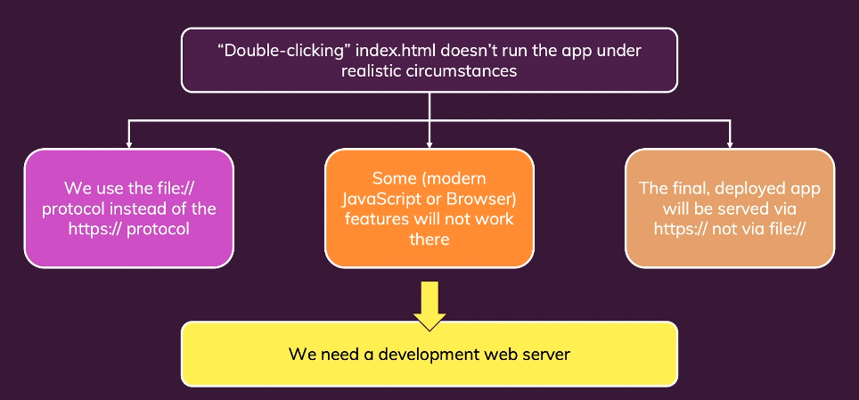
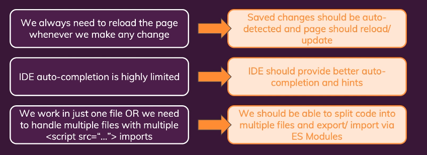
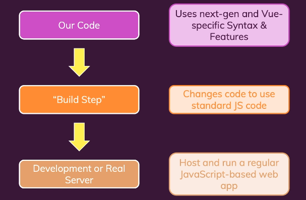

# Dev server







# Vue CLI

https://cli.vuejs.org/

https://www.youtube.com/watch?v=xht56VLMCY8

```bash
# Install
npm install -g @vue/cli
# OR
yarn global add @vue/cli
vue --version

# Upgrade
npm update -g @vue/cli

# OR
yarn global upgrade --latest @vue/cli
```

# Creating a Project

## vue create

```bash
vue create hello-world
vue create --help
```

## Using the GUI

```bash
vue ui
```

## Pulling 2.x Templates (Legacy)

Vue CLI >= 3 uses the same `vue` binary, so it overwrites Vue CLI 2 (`vue-cli`). If you still need the legacy `vue init` functionality, you can install a global bridge:

```bash
npm install -g @vue/cli-init
# vue init now works exactly the same as vue-cli@2.x
vue init webpack my-project
```