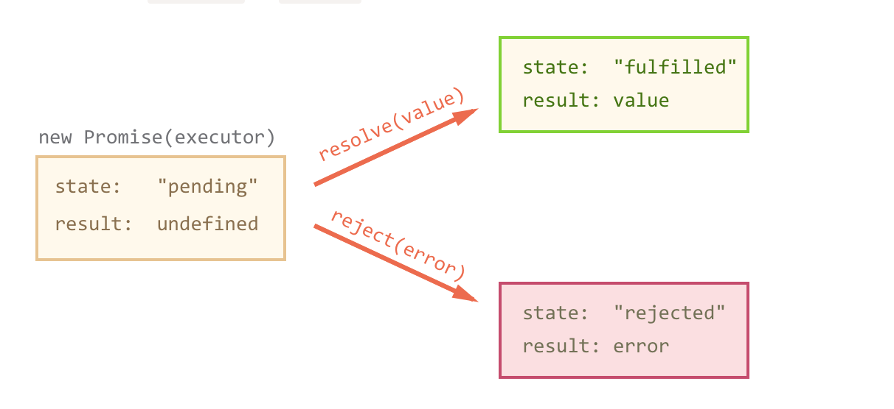

# JS runtime environment

event loop, API's, task/callback queue, job/micro-task queue


*AJAX, the DOM tree, and other API’s, are not part of JavaScript (Engine), they are just objects with properties and methods, provided by the browser and made available in the browser’s JS Runtime Environment.*

Also in the runtime environment is a **JavaScript Engine (callstack, memory heap)** that parses and run the code

## JS is single-threaded

one thread == one callstack == one thing at one time


## Some code can't be finished immediately

timeout, http request, event listener,...


=> Blocking code execution


=> **Runtime environment** is responsible for asynchronous action by using **multiple threads**, so JS code will not blocked in main thread.

## How we can do asynchronous action 

https://www.youtube.com/watch?v=PNa9OMajw9w

https://www.youtube.com/watch?v=8aGhZQkoFbQ

https://www.youtube.com/watch?v=cCOL7MC4Pl0&feature=emb_logo

https://medium.com/@Rahulx1/understanding-event-loop-call-stack-event-job-queue-in-javascript-63dcd2c71ecd

https://medium.com/preezma/node-js-event-loop-architecture-go-deeper-node-core-c96b4cec7aa4

https://medium.com/@onlykiosk/javascript-queue-stack-heap-thread-process-recursion-stack-overflow-event-loop-macro-task-7bc0db138899

https://medium.com/better-programming/is-javascript-synchronous-or-asynchronous-what-the-hell-is-a-promise-7aa9dd8f3bfb

JS runtime environment provide us **APIs** to work with asynchronous task in other threads **parallelly** for not blocking main JavaScript thread.  

From **call stack**, if an asynchronous action pop off the stack, it will be handed to the **API container (environment)** to run in **another thread**. When any action is done or an event occurred, the **callback handler function** is sent to the end of the **callback (message) queue**. 

**Event loop** job is waiting to the stack empty, take one item in queue, push to the **call stack** and then the **JS engine** will handle the callback code


**TLDR**: Handing the asynchronous (long) task to the **environment** which push **callback to queue** when **done that task**, while we **continue in JavaScript thread** and handle the **callback** when **JavaScript thread free** by using **event loop** so that Javascript code is **never blocked** (if there is no really long JS operations like long for loops, heavy calculation,...)

## Event loop in actions


=> Browser handler setTimeout, JS continue exec code


=> done timer


=> When the call stack is empty, the event loop executes and push a waiting messages to the call stack and JS engine will executes it 


### Browser


### Node

No script parsing event (`script` tag)

No user interaction (clicking on the page)

No animation frame callbacks, no render (No DOM **Manipulation**)


### Web worker

No script parsing event (`<script>` tag)

No user interaction

No DOM **Manipulation**

## Asynchronous Callback

Function that after finishing an async job, put in the callback queue, wait callstack empty to run

( >< function is passed to another simple function (not an API of browser), put in the call stack)


Task depend on before task => Callback in Callback => Callback hell

## Promise 


A promise is an object that may produce a single value some time in the future

Promises are eager, meaning that a promise will start doing the task you give it (the function passed to the promise) as soon as the promise constructor is invoked


## How it work

A promise is an object which can be returned synchronously from an asynchronous function. It will be in one of 3 possible states:

- **Fulfilled:** `onFulfilled()` will be called (e.g., `resolve()` was called)
- **Rejected:** `onRejected()` will be called (e.g., `reject()` was called)
- **Pending:** not yet fulfilled or rejected

Once settled (*not pending* = it has been resolved or rejected), a promise can not be resettled. Calling `resolve()` or `reject()` again will have no effect. The immutability of a settled promise is an important feature.

```javascript
const wait = time => new Promise((resolve) => setTimeout(resolve, time));
wait(3000).then(() => console.log('Hello!')); // 'Hello!'
```

## Then()

```javascript
promise.then(
  onFulfilled?: Function,
  onRejected?: Function
) => Promise
```

The `.then()` method must comply with these rules:

- Both `onFulfilled()` and `onRejected()` are optional.

- If the arguments supplied are not functions, they must be ignored.

- `onFulfilled()` will be called after the **promise** is fulfilled, with the promise’s value as the first argument.v

- `onRejected()` will be called after the **promise** is rejected, with the reason for rejection as the first argument. The reason may be any valid JavaScript value recommend using Error objects (rejections = exceptions)

- Neither `onFulfilled()` nor `onRejected()` may be called more than once.

- `.then()` may be called many times on the same promise. In other words, a promise can be used to aggregate callbacks.

- `.then()` will return a new promise, `promise2`.

- when `onFulfilled()` or `onRejected()` return something.  If you return a value `x`, the next `then()` is called  (`promise2` **will be fulfilled**) with that value `x`. However, if you return something promise-like `p`, the next `then()` waits on it (`promise2` **resolve**  **whatever `p` resolves**) , and is only called when that promise settles (succeeds/fails).

  ```js
  let p1 = new Promise(function(resolve, reject) {
      resolve(42);
  });
  
  let p2 = new Promise(function(resolve, reject) {
      resolve(43);
  });
  
  let p3 = p1.then(function(value) {
      // first fulfillment handler
      console.log(value);     // 42
      return p2;
  });
  
  p3.then(function(value) {
      // second fulfillment handler
      console.log(value);     // 43
  });
  ```

- If either `onFulfilled` or `onRejected` throws an exception `e`, `promise2` will be rejected with `e` as the reason.

- If `onFulfilled` is not a function and `promise1` is fulfilled, `promise2` will be fulfilled with the same value as `promise1`.

- If `onRejected` is not a function and `promise1` is rejected, `promise2` will be rejected with the same reason as `promise1`.

- A pending promise may transition into a fulfilled or rejected state.

- A fulfilled or rejected promise is settled, and must not transition into any other state.

- Once a promise is settled, it must have a value (which may be `undefined`). That value must not change.

  

```javascript
console.log('before')
const promise = new Promise(function fn(resolve, reject) {
  console.log('hello')
  // ...
});
console.log('after')
//before
//hello
//after

[promise1, promise2, promise3].reduce(function(currentPromise, promise) {
  return currentPromise.then(promise)
}, Promise.resolve())

// Same
Promise.resolve().then(promise1).then(promise2).then(promise3)
```

## Error

If a promise in chain reject, **all** then() will be **skipped** until meet a catch() 

```javascript
promise 
  .then(handleSuccess)
  .catch(handleError)
  .then(continueHandler)
```

## Promises instead of callbacks?

- Avoid callback hell which can be unreadable.
- Makes it easy to write sequential asynchronous code that is readable (1 nested level) with `.then()`.
- Makes it easy to write parallel asynchronous code with `Promise.all()`.
- With promises, these scenarios which are present in callbacks-only coding, will not happen:
  - Call the callback too early
  - Call the callback too late (or never)
  - Call the callback too few or too many times
  - Fail to pass along any necessary environment/parameters
  - Swallow any errors/exceptions that may happen

> #### `Promise.all()`
>
> Return a promise with the combined data of all promise
>
> #### `Promise.race()`
>
> Return a promise with the result of the fastest promise
>
> #### `Promise.allSeettled()`
>
> Return a promise with the detail of all promise
>

# Async/Await 

[async await javascript without try catch (anonystick.com)](https://anonystick.com/blog-developer/async-await-javascript-without-try-catch-202011289973428)

Async functions are functions that auto return a promises

```javascript
// Async/Await version
async function helloAsync() {
  return "hello";
}
// Promises version
function helloAsync() {
  return new Promise(function (resolve) {
    resolve("hello");
  });
}
```

Write async code a bit more like synchronous code


## How it works

- **Async Functions** are declared by prepending the word `async` in their declaration `async function doAsyncStuff() { ...code }`

  It wraps everything inside of the async function into one big promise.

- Your code can waiting for a **promise settled**  with `await` and next line code can only execute after that **promise settled** (only code in the async function)

  It replicate `then` behind the scene, return that promise and get result of the promise 

- `await` can only be used inside an `async` function.

  ```js
  function printAll(){
    printString("A")
    .then(() => printString("B"))
    .then(() => printString("C"))
  }
  printAll()
  
  async function printAll(){
    await printString("A")
    await printString("B")
    await printString("C")
  }
  printAll()
  ```

  

  

  

## Error handle

- If a **promise** throws an exception or `reject()` , we can handle by using `try/catch`. **exceptions will get swallowed** if they are not caught somewhere in the async function chain. 
- It is a good practice to always have one `try/catch` per chain. This will provide one single place to deal with errors while doing async work and will force you to correctly chain your **Async Function** calls.


## Use an async function

```javascript
// Option 1:
doManyThings();
// Option 2: Call it inside another Async Function wrapped with a try/catch block.
(async function() {
  try {
    await doManyThings();
  } catch (err) {
    console.error(err);
  }
})();
// Option 3: Use it as a Promise.
doManyThings().then((result) => {  // Do the things that need to wait for our function}).catch((err) => {
  throw err;
});
```

## RxJS

[Introduction - Learn RxJS](https://www.learnrxjs.io/)

[RxJS - Introduction](https://rxjs.dev/guide/overview)