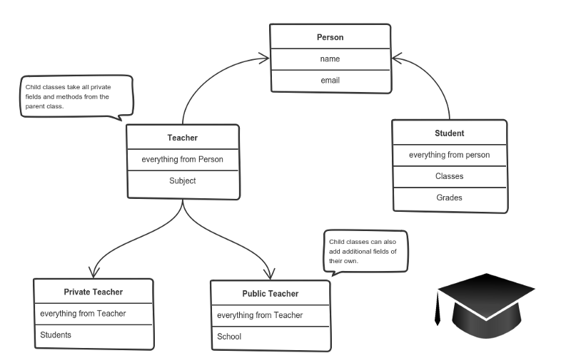

# OOP

## Principles of OOP


## Encapsulation

TDLR: allow what allow to do by access modifier public, private, protected

Encapsulation is the mechanism of hiding of data implementation by restricting access to public things (data and methods) and don't allow to access to private things

Only inside of object's class can access to **private** things . And the object only expose public things for the outside.

## Inheritance

This reuse the common logic

It means that you create a (child) class by deriving from another (parent) class. This way, we form a hierarchy.

The child class reuses all fields and methods of the parent class (common part) and can implement its own (unique part).



## Polymorphism

 polymorphism gives a way to use a class exactly like its parent so there’s no confusion with mixing types. But each child class keeps its own implement methods as they are.


## Abstraction

Applying abstraction means that each object should expose a high-level mechanism for using it.

Abstract means a concept or an Idea which is not associated with any particular instance. Using abstract class/Interface we express the intent of the class rather than the actual implementation. In a way, one class should not know the inner details of another in order to use it, just knowing the interfaces should be good enough.

This mechanism should hide internal implementation details. It should only reveal operations relevant for the other objects.

Think — a coffee machine. It does a lot of stuff and makes quirky noises under the hood. But all you have to do is put in coffee and press a button.

Preferably, this mechanism should be easy to use and should rarely change over time. Think of it as a small set of public methods which any other class can call without “knowing” how they work.

## SOLID

### (S)ingle responsibility principle

One class (module, function) one job

### (O)pen/closed principle

open for extension, but closed for modification

```c#
public abstract class Shape
{
    public abstract double Area();
}
```

Inheriting from Shape the Rectangle and Circle classes now looks like this

```C#
public class Rectangle : Shape
{
    public double Width { get; set; }
    public double Height { get; set; }
    public override double Area()
    {
        return Width*Height;
    }
}

public class Circle : Shape
{
    public double Radius { get; set; }
    public override double Area()
    {
        return Radius*Radius*Math.PI;
    }
}
```

```c#
public double Area(Shape[] shapes)
{
    double area = 0;
    foreach (var shape in shapes)
    {
        area += shape.Area();
    }

    return area;
}
```

### (L)iskov Substitution Principle

objects of a parent-class shall be replaceable with objects of its child-classes without breaking the application.

### (I)nterface Segregation Principle

1 interface 1 purpose, not use big interface

### (D)ependency inversion principle

High-level modules should not depend on low-level modules. Both should depend on abstractions (e.g. interfaces).

Abstractions should not depend on details. Details (concrete implementations) should depend on abstractions.

## When abstract when interface

When we talk about abstract classes we are defining characteristics of an object type; specifying what an object is.

When we talk about an interface and define capabilities that we promise to provide, we are talking about establishing a contract about what the object can do.

Interfaces do not express something like "a Doberman is a type of dog and every dog can walk" but more like "this thing can walk"

Class abstract for "Is – A" (Ôtô là Xe) -
Interface for "Has – A" (Ô tô có thể chuyển động).

## Composition over inheritance

<https://www.youtube.com/watch?v=wfMtDGfHWpA>

<https://www.youtube.com/watch?v=7HolHe7Gqbw>


=> God object

```js
Animal
 eat()
 sound()
FlyAnimal extend Aninal
 fly()
SwimAnimal extend Animal
 swim()
MoveAnimal extend Animal
 move()
MoveAndFlyAnimal extend ?
```

Inheritance makes us turn a blind eye to the inevitable fact that our class structure will most likely change in the future, and when it does, our tightly coupled inheritance structure is going to crumble.


=> Rather than thinking in terms of what things **are**, what if we think in terms of what things **do**?

```javascript
//Obj with action
const eater = (state) => ({
  eat(amount) {
    console.log(`${state.name} is eating.`)
    state.energy += amount
  }
})
const sleeper = (state) => ({
  sleep(length) {
    console.log(`${state.name} is sleeping.`)
    state.energy += length
  }
})

const player = (state) => ({
  play() {
    console.log(`${state.name} is playing.`)
    state.energy -= length
  }
})

const barker = (state) => ({
  bark() {
    console.log('Woof Woof!')
    state.energy -= .1
  }
})

const meower = (state) => ({
  meow() {
    console.log('Meow!')
    state.energy -= .1
  }
})

const adopter = (state) => ({
  adopt(pet) {
    state.pets.push(pet)
  }
})

const friender = (state) => ({
  befriend(friend) {
    state.friends.push(friend)
  }
})
//Composing
function Cat (name, energy, declawed) {
  let cat = {
    name,
    energy,
    declawed,
    friends: []
  }

  return Object.assign(
    cat,
    eater(cat),
    sleeper(cat),
    player(cat),
    meower(cat),
  )
}
//OR
function Cat (name, energy, declawed) {
  this.name = name
  this.energy = energy
  this.declawed = declawed
  this.friends = []

  return Object.assign(
    this,
    eater(this),
    sleeper(this),
    player(this),
    meower(this),
  )
}

const charles = new Cat('Charles', 10, false)
```
